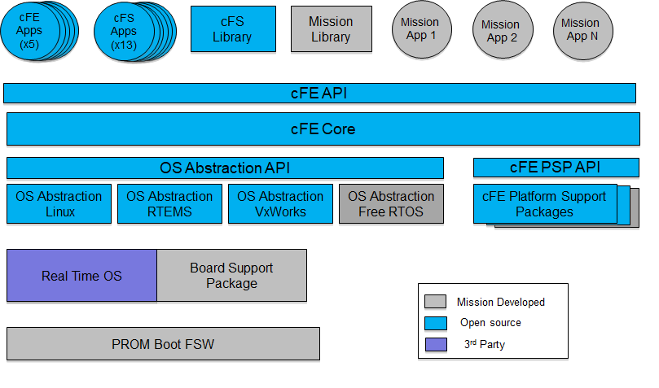

Table of Contents
=================

   * [Table of Contents](#table-of-contents)
   * [1. Introduction](#1-introduction)
    * [1.1 Scope](#11-scope)
    * [1.2 Background](#12-background)
    * [1.3 Applicable Documents](#13-applicable-documents)
    * [1.4 Acronyms](#14-acronyms)
    * [1.5 Glossary of Terms](#15-glossary-of-terms)
   * [2. cFE Application Development Environment](#2-cfe-application-development-environment)
    * [2.1 Directory Tree](#21-directory-tree)
    * [2.2 Header Files](#22-header-files)
   * [3. cFE Deployment Environment](#3-cfe-deployment-environment)
    * [3.1 Assumed On-Board Directory Structure](#31-assumed-on-board-directory-structure)
   * [4. cFE Application Architecture](#4-cfe-application-architecture)
    * [4.1	Application Model](#41application-model)
      * [4.1.1 "Software Only" Application](#411-software-only-application)
      * [4.1.2 "Hardware Servicing" Application](#412-hardware-servicing-application)
      * [4.1.3 Multi-threaded Applications](#413-multi-threaded-applications)
   * [4.2 Best Practices](#42-best-practices)
      * [4.2.1 cFE Application Template](#421-cfe-application-template)
      * [4.2.2 Avoid "Endian-ess" Dependencies](#422-avoid-endian-ess-dependencies)
      * [4.2.3 Avoid Inter-Task Dependencies](#423-avoid-inter-task-dependencies)
   * [5. Executive Services Interface](#5-executive-services-interface)
      * [5.1 Application Registration](#51-application-registration)
      * [5.2 Application Names and IDs](#52-application-names-and-ids)
      * [5.3 Child Task Control](#53-child-task-control)
      * [5.4 Application Start-Up Types](#54-application-start-up-types)
      * [5.5 Shared Libraries](#55-shared-libraries)
      * [5.6 Device Drivers](#56-device-drivers)
      * [5.7 Obtaining OS and Platform Information](#57-obtaining-os-and-platform-information)
      * [5.8 OS Queues, Semaphores and Mutexes](#58-os-queues-semaphores-and-mutexes)
        * [5.8.1 Queues](#581-queues)
        * [5.8.2 Binary Semaphores](#582-binary-semaphores)
        * [5.8.2.1 Binary Semaphore Functions](#5821-binary-semaphore-functions)
        * [5.8.3 Mutex Semaphores](#583-mutex-semaphores)
           * [5.8.3.1 Mutex Functions](#5831-mutex-functions)
      * [5.9 Interrupt Handling](#59-interrupt-handling)
      * [5.10 Exceptions](#510-exceptions)
      * [5.11 Floating Point Processor Exceptions](#511-floating-point-processor-exceptions)
      * [5.12 Memory Utilities](#512-memory-utilities)
        * [5.12.1 Memory Read/Write Functions](#5121-memory-readwrite-functions)
        * [5.12.2 Critical Data Store](#5122-critical-data-store)
        * [5.12.3	Standard CRC Calculations](#5123standard-crc-calculations)
      * [5.13 File System Functions](#513-file-system-functions)
        * [5.13.1 Device Functions](#5131-device-functions)
        * [5.13.2 Directory Functions](#5132-directory-functions)
        * [5.13.3 File Functions](#5133-file-functions)
      * [5.14 System Log](#514-system-log)
      * [5.15 Software Performance Analysis](#515-software-performance-analysis)
      * [5.16 Memory Pool](#516-memory-pool)
   * [6. Software Bus Interface](#6-software-bus-interface)
      * [6.1 Software Bus Terminology](#61-software-bus-terminology)
        * [6.1.1 Software Bus Messages](#611-software-bus-messages)
        * [6.1.2 Pipes](#612-pipes)
          * [6.1.2.1 Software Bus Message Limits and Overflows](#6121-software-bus-message-limits-and-overflows)
        * [6.1.3 Routing of Software Bus Messages](#613-routing-of-software-bus-messages)
          * [6.1.3.1 Sending Applications](#6131-sending-applications)
          * [6.1.3.2 Receiving Applications](#6132-receiving-applications)
      * [6.2 Creating Software Bus Pipes](#62-creating-software-bus-pipes)
      * [6.3 Software Bus Message Subscription](#63-software-bus-message-subscription)
      * [6.4 Unsubscribing from Receiving Software Bus Messages](#64-unsubscribing-from-receiving-software-bus-messages)
      * [6.5 Creating Software Bus Messages](#65-creating-software-bus-messages)
        * [6.5.1 Modifying Software Bus Message Header Information](#651-modifying-software-bus-message-header-information)
      * [6.6 Sending Software Bus Messages](#66-sending-software-bus-messages)
      * [6.7 Improving Message Transfer Performance for Large SB Messages](#67-improving-message-transfer-performance-for-large-sb-messages)
      * [6.8 Receiving Software Bus Messages](#68-receiving-software-bus-messages)
        * [6.8.1 Reading Software Bus Message Header Information](#681-reading-software-bus-message-header-information)
      * [6.9 Deleting Software Bus Pipes](#69-deleting-software-bus-pipes)
   * [7. Event Service Interface](#7-event-service-interface)
      * [7.1 Event Messages](#71-event-messages)
      * [7.2 Event Types](#72-event-types)
      * [7.3 Event Service Registration](#73-event-service-registration)
        * [7.3.1 Binary Filtering Scheme](#731-binary-filtering-scheme)
      * [7.4 Sending an Event Message](#74-sending-an-event-message)
        * [7.4.1 Event Message Text](#741-event-message-text)
      * [7.5 Event Service Un-registration](#75-event-service-un-registration)
   * [8. Table Service Interface](#8-table-service-interface)
      * [8.1 Table Terminology](#81-table-terminology)
        * [8.1.1 Tables](#811-tables)
        * [8.1.2 Active vs. Inactive Tables](#812-active-vs-inactive-tables)
        * [8.1.3 Single vs. Double Buffered Tables](#813-single-vs-double-buffered-tables)
        * [8.1.4 Loading/Activating a Table](#814-loadingactivating-a-table)
        * [8.1.5 Dumping a Table](#815-dumping-a-table)
        * [8.1.6 Validating a Table](#816-validating-a-table)
      * [8.2 Registering Tables](#82-registering-tables)
      * [8.3 Accessing Table Data](#83-accessing-table-data)
        * [8.3.1 Acquiring Table Data](#831-acquiring-table-data)
        * [8.3.2 Releasing Table Data](#832-releasing-table-data)
      * [8.4 Managing a Table](#84-managing-a-table)
        * [8.4.1 Validating Table Data](#841-validating-table-data)
        * [8.4.2 Loading/Updating Table Data](#842-loadingupdating-table-data)
        * [8.4.3 Simplifying Table Management](#843-simplifying-table-management)
      * [8.5 Creating Table Image Files using the elf2cfetbl Utility](#85-creating-table-image-files-using-the-elf2cfetbl-utility)
        * [8.5.1 elf2cfetbl utility files](#851-elf2cfetbl-utility-files)
        * [8.5.2 Creating an Executable of the elf2cfetbl Utility](#852-creating-an-executable-of-the-elf2cfetbl-utility)
        * [8.5.3 Preparing a Source File for use with the elf2cfetbl Utility](#853-preparing-a-source-file-for-use-with-the-elf2cfetbl-utility)
        * [8.5.4 Example of Table Data Source File](#854-example-of-table-data-source-file)
        * [8.5.5 elf2cfetbl Utility Command Line Options](#855-elf2cfetbl-utility-command-line-options)
        * [8.5.6 Converting COFF Object Files into ELF Object Files](#856-converting-coff-object-files-into-elf-object-files)
   * [9. File Service Interface](#9-file-service-interface)
      * [9.1 Standard File Header](#91-standard-file-header)
      * [9.2 Accessing and Modifying the Standard File Header](#92-accessing-and-modifying-the-standard-file-header)
      * [9.3 Other File Service Utility Functions](#93-other-file-service-utility-functions)
   * [10 Time Service Interface](#10-time-service-interface)
      * [10.1 Time Formats](#101-time-formats)
      * [10.2 Time Values](#102-time-values)
      * [10.3 Basic Time Functions](#103-basic-time-functions)
      * [10.4 Time Conversion Functions](#104-time-conversion-functions)
      * [10.5 Time Manipulation Functions](#105-time-manipulation-functions)
   * [11 Error Handling](#11-error-handling)
      * [11.1 Standard Error Codes](#111-standard-error-codes)
   * [Appendix A](#appendix-a)

# 1. Introduction

#### 1.1 Scope

The purpose of this document is to provide guidelines and conventions
for flight code development using the Core Flight Executive (cFE)
Application Programming Interface (API). These interfaces apply to C&DH,
ACS and instrument control software; note that particular subsystems may
need to follow specific software coding guidelines and standards in
addition to using the functions provided within the cFE API.h

These guidelines and conventions are specified with different weights.
The weighting can be determined by the use of the following words:

1.  **"Shall"** or **"must"** designates the most important
    weighting level and are mandatory. Any deviations from these
    guidelines or conventions must have, at a minimum, the
    non-compliance documented fully and, at a maximum, require a project
    management waiver.

2.  **"Should"** designates guidelines that are    determined to be good
    coding practice and are helpful for code maintenance, reuse, etc.
    Noncompliance with *should* requirements does not require waivers
    nor additional documentation but appropriate comments in the code
    would be useful.

3.  **"Could"** designates the lowest weighting level. These *could*
    requirements designate examples of an acceptable implementation but
    do not require the developer to follow the example precisely.

#### 1.2 Background

The cFE provides a project-independent Flight Software (FSW) operational
environment with a set of services that are the functional building
blocks to create and host FSW Applications. The cFE is composed of six
core services: Executive Service (ES), Software Bus Service (SB), Event
Service (EVS), Table Service (TBL), and Time Service(TIME) (See Figure 1). Each cFE service defines an API that is available to the application as a library of functions.

It is important for application developers to realize the long term goal
of the cFE. With a standard set of services providing a standard API,
all applications developed with the cFE have an opportunity to become
useful on future missions through code reuse. In order to achieve this
goal, applications must be written with care to ensure that their code
does not have dependencies on specific hardware, software or compilers.
The cFE and the underlying generic operating system API (OS API) have
been designed to insulate the cFE Application developer from hardware
and software dependencies. The developer, however, must make the effort
to identify the proper methods through the cFE and OS API to satisfy
their software requirements and not be tempted to take a “short-cut” and
accomplish their goal with a direct hardware or operating system
software interface.


#### 1.3 Applicable Documents

| **Location**    | **Documents**      | **Description** |
|:----------------|:-------------------|:----------------|
| https://github.com/nasa/osal/tree/master/doc |	Osal Library API.doc | Describes OSAL API |
| https://github.com/nasa/cFE/tree/master/docs |  cFE Application Developers Guide.doc      |	cFE developer’s guide. Contains best practice, various API informations and example implementation.|
| TBD             |	PSP API (TBD)      |	Describes PSP API  |


#### 1.4 Acronyms

  | **Acronym** | **Description** |
  |:-----------|:----------------|
  | AC          | Attitude Control                                   |
  | ACE         | Attitude Control Electronics                       |
  | ACS         | Attitude Control System                            |
  | API         | Application Programming Interface                  |
  | APID        | CCSDS Application ID                               |
  | CCSDS       | Consultative Committee for Space Data Systems      |
  | CDH, C&DH   | Command and Data Handling                          |
  | CM          | Configuration Management                           |
  | CMD         | Command                                            |
  | CPU         | Central Processing Unit                            |
  | EDAC        | Error Detection and Correction                     |
  | EEPROM      | Electrically Erasable Programmable Read-Only Memory|
  | FC          | Function Code                                      |
  | FDC         | Failure Detection and Correction                   |
  | FSW         | Flight Software                                    |
  | HW, H/W     | Hardware                                           |
  | ICD         | Interface Control Document                         |
  | MET         | Elapsed Time                                       |
  | OS          | Operating System                                   |
  | PID         | Pipeline ID                                        |
  | PKT         | Packet                                             |
  | RAM         | Random-Access Memory                               |
  | SB          | Software Bus                                       |
  | SDO         | Solar Dynamics Observatory                         |
  | ST5         | Space Technology Five                              |
  | STCF        | Spacecraft Time Correlation Factor                 |
  | SW, S/W     | Software                                           |
  | TAI         | International Atomic Time                          |
  | TBD         | To Be Determined                                   |
  | TBL         | Table                                              |
  | TID         | Application ID                                     |
  | TLM         | Telemetry                                          |
  | UTC         | Coordinated Universal Time                         |


  #### 1.5 Glossary of Terms


  The following table defines the terms used throughout this document.
  These terms are identified as proper nouns and are capitalized.

  | **Term** | **Definition** |
  |:---------|:---------------|
  | Application (APP) | A set of data and functions that is treated as a single entity by the cFE. cFE resources are allocated on a per-Application basis. Applications are made up of a Main Task and zero or more Child Tasks.|
  | Application ID| A processor unique reference to an Application. <p> NOTE: This is different from a CCSDS Application ID which is referred to as an “APID.”</p>|
  | Application Programmer’s Interface (API)| A set of routines, protocols, and tools for building software applications |
  |Board Support Package (BSP) | A collection of user-provided facilities that interface an OS and the cFE with a specific hardware platform. The BSP is responsible for hardware initialization. |
  | Child Task | A separate thread of execution that is spawned by an Application’s Main Task.|
  | Command | A SB Message defined by the receiving Application. Commands can originate from other onboard Applications or from the ground. |
  | Core Flight Executive (cFE) | A runtime environment and a set of services for hosting FSW Applications |
  | Critical Data Store | A collection of data that is not modified by the OS or cFE following a Processor Reset. |
  | Cyclic Redundancy Check | A polynomial based method for checking that a data set has remained unchanged from one time period to another. |
  Developer | Anyone who is coding a cFE Application. |
  | Event Data | Data describing an Event that is supplied to the cFE Event Service. The cFE includes this data in an Event Message. |
  | Event Filter | A numeric value (bit mask) used to determine how frequently to output an application Event Message defined by its Event ID (see definition of Event ID below). |
  | Event Format Mode |Defines the Event Message Format downlink option: short or long. The short format is used when there is limited telemetry bandwidth and is binary. The long format is in ASCII and is used for logging to a Local Event Log and to an Event Message Port. |
  | Event ID |A numeric literal used to uniquely name an Application event. |
  | Event Message | A data item used to notify the user and/or an external Application of a significant event. Event Messages include a time-stamp of when the message was generated, a processor unique identifier, an Application ID, the Event Type (DEBUG,INFO,ERROR or CRITICAL), and Event Data. An Event Message can either be real-time or playback from a Local Event Log. |
  | Event Message Counter | A count of the number of times a particular Event Message has been generated since a Reset or since the counter was cleared via a Command. The counter does not rollover so a user cannot lose the knowledge that an event had occurred. |
  | Event Message Port | A display device that is used to display Event Messages in a test environment. The communications mechanism between the flight processor and the display device is platform defined. |
  | Event Type | A classification of an Event Message such as informational, diagnostic, and critical. See Section 7.2 for a definition of these types. |
  |FIFO | First In First Out - A storage device that implies the first entry in is the first entry out. |
  | Hardware Platform | The target hardware that hosts the FSW. |
  | Interface Control Document | A document that describes the software interface, in detail, to another piece of software or hardware. |
  | I/O Data | Any data being written to and read from an I/O port. No structure is placed on the data and no distinction as to the type of I/O device. I/O data is defined separately from memory data because it has a separate API and it’s an optional interface of the cFE. |
  | Local Event Log | An optional Critical Data Store containing Event Messages that are generated on the same processor on which it resides. One Local Event Log can be defined for each processor. |
  | Log | A collection of data that an application stores that provides information to diagnose and debug FSW problems.|
  | Main Task | The thread of execution that is started by the cFE when an Application is started. |
  | Memory Data | Any data being written to and read from memory. No structure is placed on the data and no distinction as to the type of memory is made. |
  | Message ID | An identifier that uniquely defines an SB message.|
  | Mission | A particular implementation of cFE FSW for a specific satellite or set of satellites.|
  | MMU | Memory Management Unit. A piece of hardware that manages virtual memory systems. It automatically translates addresses into physical addresses so that an application can be linked with one set of addresses but actually reside in a different part of memory. |
  | MsgId-to-Pipe Limit | The maximum number of messages of a particular Message ID allowed on a Pipe at any time. When a MsgId-to-Pipe Limit is exceeded, it is considered an error and is sometimes referred to as a MsgId-to-Pipe Limit error. |
  | Network | A connection between subsystems used for communication purposes. |
  | Network  Queue | A device that stores messages and controls the flow of SB Messages across a Network. |
  | Operational Interface | The Command and Telemetry interface used to manage the cFE and/or Applications.|
  | Operator | Anyone who is commanding the FSW and receiving the FSW telemetry. |
  | Pipe | A FIFO device that is used by Application’s to receive SB Messages. |
  | Pipe Depth | The numbers of SB Messages a Pipe is capable of storing. |
  | Pipe Overflow | Occurs when an attempt is made to write to a Pipe that is completely full of SB Messages. The number of SB Messages a Pipe can hold is given by the Pipe Depth. When a Pipe overflows, it is considered an error and is sometimes referred to as a Pipe Overflow error |
  | Platform | See “Hardware Platform” above. |
  | Processor Reset | The processor resets via the execution of its reset instruction, assertion of its reset pin, or a watchdog timeout. |
  | Power-on Reset | The processor initializes from a no-power state to a power-on state. |
  | Quality of Service (QoS) | Quality of Service has 2 components, Priority and Reliability. |
  | Request | The act of an Application invoking a cFE service that resides on the same processor as the Application. A “Request” may be implemented as either function calls or SB Message exchanges and is specified in this document. |
  | Routing Information | Any information required to route SB Messages locally or remotely. |
  | Software Bus | An inter-Application message-based communications system |
  | SB Message | A message that is sent or received on the software bus. |
  | Subscribe | The act of requesting future instances of an SB Message to be sent on a particular Pipe. A valid subscription alters the SB Routing Information. |
  | System Log | Special “Event Message” log for events that occur when the Event Services are not available. |
  | Telemetry | A SB Message defined by the sending Application that contains information regarding the state of the Application or the state of devices interfaced to the Application. |
  | Unsubscribe | To request that an SB Message no longer be routed to a particular Pipe. Properly unsubscribing to an SB Message alters the SB Routing Information. |
  | User | Anyone who interacts with the cFE in its operational state. A user can be a FSW developer, a FSW tester, a spacecraft tester, a spacecraft operator, or a FSW maintainer. |

# 2. cFE Application Development Environment

The following section describes the details of the standard cFE
development environment in which the Developer writes and integrates
their Application code. Each Mission could have, for their own reasons,
a variation on this standard.

#### 2.1 Directory Tree

The following diagrams show the standard development and build directory
tree or mission tree as it is often referred to. The purpose of each
directory is described as a note under each folder.


#### 2.2 Header Files

In order for applications to use and call cFE service functions, the
Developer must include the appropriate header files in their source
code. The cFE can be easily incorporated by including the following
line:

```
#include "cfe.h" \* Define cFE API prototypes and data types */
```

However, if the Developer is interested in viewing the API prototype
declarations or data type definitions, they must look for them in the
header file for the particular cFE Service. These header files are named
as follows:

| **Filename** | **Contents** |
| ------------:| ------------:|
| cfe_es.h     | cFE Executive Service interface      |
| cfe_evs.h    | cFE Event Service Interface          |
| cfe_fs.h     | cFE File Service Interface           |
| cfe_sb.h     | cFE Software Bus Interface           |
| cfe_sbp.h    | cFE Software Bus Protocol Interface  |
| cfe_tbl.h    | cFE Table Service Interface          |
| cfe_time.h   | cFE Time Service Interface           |

All of these header files can be found in the **"\.../cfe-core/inc/"**
directory.

# 3. cFE Deployment Environment

The cFE core makes some assumptions about the target platform.
Modifications to these assumptions would require modification to the cFE
core source code.

#### 3.1 Assumed On-Board Directory Structure

Portions of the cFE are capable of generating/overwriting files in
response to commands (e.g. -- log files, registry contents, etc). The
cFE assumes that a specific file architecture is present when it
generates these files. The file architecture and the expected contents
are described in the diagram below.


# 4. cFE Application Architecture

In order to achieve the long term goals of the cFE, the Developer should
structure their Applications with one of the following frameworks. Each
of the frameworks described below have been designed to minimize code
modification when the code is ported to either another platform and/or
another mission.

#### 4.1	Application Model

##### 4.1.1 "Software Only" Application

A "Software Only" Application is a cFE Application that does not require
communication with hardware directly. It is an Application that receives
messages via the Software Bus, manipulates the data, and issues messages
which are either telemetry or commands. Examples of "Software Only"
Applications in the past would be Attitude Determination and Control
(ACS), Absolute Time Command Processor (ATCP) and/or Relative Time
Command Processor (RTCP).

A "Software Only" Application has the most promise of being reusable
because it is insulated from most mission and platform specific
characteristics. Therefore, the Developer must conform to the framework
below to ensure maximum reusability in the future.

As seen in the following diagram, a "Software Only" application, shown
here as either a "Reuse Application" or a "Mission Application," should
never talk directly with any piece of hardware nor directly with the
underlying operating system.



The Developer should ensure that all function calls to functions outside
of the Application code are either to the cFE APIs or to the OS
Abstraction Layer. Both of these are found in the Executive Layer.

##### 4.1.2 "Hardware Servicing" Application

A "Hardware Servicing" Application is a cFE Application that is talking
directly to a piece of hardware. This could be mission specific
hardware, such as an experiment, or more common hardware, such as a
receiver or transmitter. "Hardware Servicing" Applications should follow
the Device Driver model as shown in the following diagram.


A "hardware servicing" Application first associates a set of three
functions with a particular hardware interrupt via the cFE Executive
Services device driver API. The first of the three functions performs
any necessary hardware configuration and initialization. The second
function runs within the ISR context whenever there is an interrupt
generated by the hardware. This is useful for performing any realtime
processing and hardware handshaking that must occur quickly and without
interruption. Upon completion of the ISR function, the cFE notifies a
device processing task that it created during the registration process
that an interrupt occurred. This processing task calls the third
callback function specified by the "hardware servicing" Application.
This function, since it is running in a task context rather than an ISR
context, is allowed full use of other cFE Service APIs. It is capable of
sending messages, events, performing memory allocation, etc. For further
details on this design, see section 5.6 and the device management API
reference in Appendix A.

##### 4.1.3 Multi-threaded Applications

The cFE supports the concept of multiple threads within an Application.
Each thread is referred to as a Task. The first Task that executes when
the Application is started is referred to as the Main Task. Any other
Tasks that are spawned by the Main Task are called Child Tasks. When
deciding on whether to create multiple Applications versus a single
Application with multiple Tasks, the Application Developer should keep
in mind these facts:

-   Child Tasks can only execute at a priority equal to or less than the
    priority of the Application's Main Task.

-   If the Main Task of an Application is stopped, either through
    detection of an exception or via command, all Child Tasks are also
    stopped.

#### 4.2 Best Practices
##### 4.2.1 cFE Application Template

Applications designed to interface with the cFE should follow standard templates.  Reference sample_app on Github for “live” example.

| **Files** | **Descriptions** |
|:----------|:-----------------|
|fsw/src/sample_app.c   | Main source code for sample_app. Located in src directory. |
| fsw/src/sample_app.h  | Main header file for sample_app. It contains your main global typedef, prototypes, and miscellaneous define. |
| fsw/src/sample_app_events.h  | Defines sample_app event IDs  |
|fsw/src/sample_app_msg.h   | Defines sample_app commands and its structures  |
| fsw/tables/sample_table.c   |  Define sample_app table(s) |
| fsw/platform_inc/sample_app_msgids.h  | Define sample_app message IDs  |
|fsw/mission_inc/sample_app_perfids.h   | Define sample_app performace IDs  |

##### 4.2.2 Avoid "Endian-ess" Dependencies

To ensure Application portability, Developers should be aware of code
designs that can be affected by the "Endian-ess" of the processor. An
example of where this could be a problem is in those situations where it
is necessary to extract multi-byte data types from a stream of bytes.
When this occurs, the Developer should ensure that if the source of the
stream were to change from little-endian to big-endian or vice-versa,
that the extraction would be successful. In a worse case situation, this
may require the use of compiler switches based upon a platform's endian
setting to include the appropriate code.

Another common problem is in telemetry formatting. Frequently a
telemetry packet is defined as a data structure of a variety of data
types. Clearly, if the code is ported from a little-endian machine to a
big-endian machine or vice-versa, the ground system telemetry database
would be required to change.

##### 4.2.3 Avoid Inter-Task Dependencies
The Developer must separate those items that represent interface
controlled data structures and values from other aspects of their
software into unique header files. These files are then available to
other Applications at compile time and act as the ICD between two or
more Applications. When an Application is modified, it should be the
only Application that needs to be recompiled for a change unless the
change affects the published interface to other Applications.

Examples of items that must be shared with other Applications include
Message IDs and Message data structures. Examples of items that do not
need to be shared with other Applications include Table IDs, Table data
structures, Event IDs and Pipe IDs.


# 5. Executive Services Interface

As seen in the diagram in Section 4.1, the cFE Executive Services is a
layer that incorporates the OS Abstraction Layer (OS API). The OS API
was originally developed with the intent to provide a common interface
for all Applications regardless of which RTOS the Application was
running on. The OS API was also designed to have as small a footprint as
possible so that it could be implemented on a wide range of processors.
The cFE has been designed to take advantage of this OS Abstraction Layer
to improve its portability from one RTOS to the next. Since the cFE
provides additional Executive Services that are not available with a
standard RTOS, it stands between the OS API and the cFE Application.
However, since duplicating the OS API in the cFE would add an
unnecessary level in many cases, the OS API is also visible to cFE
Applications. Therefore, a developer needs to be cognizant that some of
the API calls will either start with "CFE_ES_", because they are a
member of the cFE Executive Services API, or they will start with "OS_"
because they are a part of the OS Abstraction Layer. If there are two
functions that appear to behave similarly and one is an "OS_" function
and the other is a "CFE_ES_" function, the Developer should use the
"CFE_ES_" function. Additional information about the OS API can be
found in the *OS Abstraction Layer Library* document.

#### 5.1 Application Registration

All cFE Applications must register immediately with ES when started.
This is accomplished with the CFE_ES_RegisterApp function and it
should be the first function called by a cFE Application's main task.

#### 5.2 Application Names and IDs

The Executive Services maps Application names to Application IDs which
are numeric. This simplifies the identification of Applications within
the processor (by the numeric) but retains the human readable
Application names for situations when the information is to be presented
to an operator. Translating one reference of an Application to the other
is accomplished with one of the following functions:
CFE_ES_GetAppIDByName and CFE_ES_GetAppName. The first will return
the numeric Application ID when given an Application name and the latter
will give the Application name when given the Application ID. If a Task
needs to obtain its own Application ID if can call CFE_ES_GetAppID.
For this function, it is important to remember that an Application's
main task and all of its children tasks are considered to be the same
Application. Therefore, no matter whether the call is made from the Main
Task or one of the Child Tasks, the Application ID returned would be the
same.

#### 5.3 Child Task Control

As mentioned in section 4.3, cFE Applications can be multi-threaded.
Each thread is referred to as a Task. The thread that is started when
the Application is loaded and run is referred to as the Main Task. Any
additional threads that are spawned by this thread are referred to as
Child Tasks. There are a handful of functions provided by the Executive
Services for controlling Child Tasks. The first is
CFE_ES_CreateChildTask. This function spawns a Child Task that is
"owned" by the Main Task. Each of the Child Tasks must then register
with ES via the CFE_ES_RegisterChildTask function. The remaining
functions, CFE_ES_DeleteChildTask, CFE_ES_SuspendChildTask and
CFE_ES_ResumeChildTask can control the existence and execution of the
Child Task. All of these functions require the task ID that is returned
by the CFE_ES_CreateChildTask function in order to identify the Child
Task.

#### 5.4 Application Start-Up Types

Upon startup, an Application may need to know which type of restart it is undergoing.  As part of its initialization, an Application should call CFE_ES_GetResetType to determine the type of restart it is undergoing.  The return value of this function can be any one of the following 2 values:

1)	CFE_PSP_RST_TYPE_POWERON

2)	CFE_PSP_RST_TYPE_PROCESSOR

Reference CFE API documentations.

#### 5.5 Shared Libraries

The cFE contains support for shared libraries. For the current version
of the cFE, the shared libraries must be loaded on cFE startup (see the
cFE Deployment Guide on how to modify the cfe_es_startup.scr in order
to load a shared library at startup). The capability to add and remove
shared libraries during runtime will be available in a later build.

Reference Sample_lib on Github for “live” example.

#### 5.6 Device Drivers

Reference “hardware libraries”.

#### 5.7 Obtaining OS and Platform Information

There are numerous function related to obtaining OS and platform
information. A number of these functions are not necessary for the cFE
Application Developer. The functions that are the most useful to the
Application Developer are as follows:

CFE_PSP_GetSpacecraftId returns an identifier associated with a specific spacecraft.  This may be useful when the same software may be executing on multiple spacecraft as part of a multi-spacecraft mission.

CFE_PSP_GetProcessorId returns an identifier associated with a specific processor.  This may be useful when the same software may be executing on multiple processors on the same spacecraft.

For understanding and compensating for the processor timer on a
particular platform, the following two functions provide important
information.

OS_Milli2Ticks converts a given number of milliseconds into the
appropriate number of processor clock ticks for a given amount of time.
The Developer should never hard-code a time related value in clock
ticks. When the code is ported to another processor, it is important for
any time values to automatically adjust appropriately.

OS_InfoGetTicks returns the number of microseconds per operating system
clock tick. This can also be used to calculate the appropriate number of
system clock ticks for a specific delta time. An example can be seen
below:

```
uint32 ConvertSecs2Ticks(uint32 Seconds)
{
	uint32 NumOfTicks,TickDurationInMicroSec;

	TickDurationInMicroSec = OS_InfoGetTicks();

	NumOfTicks =
		( (Seconds * 1000000) + TickDurationInMicroSec - 1 ) / TickDurationInMicroSec;

	return(NumOfTicks);

}
```
#### 5.8 OS Queues, Semaphores and Mutexes

##### 5.8.1 Queues

Developers are discouraged from using the OS_QueueCreate, OS_QueueGet
and OS_QueuePut functions. These functions are a lower level
duplication of the Software Bus Services pipes. Their usage limit the
visibility into data messages being passed between Applications and they
would also impose a requirement that two Applications must reside on the
same processor. The only exception to this rule might be communication
between a Main Task and its Child Tasks.

##### 5.8.2 Binary Semaphores

Binary semaphores can be used for Application synchronization. A binary
semaphore is essentially a flag that is available or unavailable. When
an Application *takes* a binary semaphore, using the OS_BinSemTake
function, the outcome depends on whether the semaphore is available or
unavailable at the time of the call. If the semaphore is available, then
the semaphore becomes unavailable and the Application continues
executing immediately. If the semaphore is unavailable, the Application
is put on a queue of blocked Applications and enters a pending state
waiting for the availability of the semaphore.

When an Application *gives* a binary semaphore, using the OS_BinSemGive
function, the outcome depends on whether the semaphore is available or
unavailable at the time of the call. If the semaphore is already
available, giving the semaphore has no effect at all. If the semaphore
is unavailable and no Application is waiting to take it, then the
semaphore becomes available. If the semaphore is unavailable and one or
more Applications are pending on its availability, then the first
Application in the queue of pending Applications is unblocked, and the
semaphore is left unavailable.

Each semaphore is labeled by an integer ID, which is defined in the
header file osids.h by a macro of the form *xxx*_SEM_ID. To add a new
semaphore to a processor, one must modify the osids.h file and
osobjtab.c file for the processor.

##### 5.8.2.1 Binary Semaphore Functions

There are two options for pending on a semaphore:

```
int32 OS_BinSemTake( uint32 xxx_SEM_ID );
```

which waits indefinitely for a semaphore to become available, and

```
int32 OS_BinSemTimedWait( uint32 xxx_SEM_ID , uint32 timeout_in_milliseconds );
```

which waits for a specified timeout period and quits if the semaphore
has not become available. Both functions return a status code with these
possible values:

- OS_SUCCESS --- semaphore was obtained

- OS_SEM_TIMEOUT --- semaphore was not obtained within specified
  timeout

- OS_SEM_FAILURE --- error (such as invalid semaphore ID)

An application should always check the status code to verify that the
semaphore was obtained.

A semaphore is given by using this function:

```
int32 OS_BinSemGive( uint32 xxx_SEM_ID );
```

The function returns a status code indicating success (OS\_SUCCESS) or
failure (OS\_SEM\_FAILURE). An application should check the status code
and report a failure with an event message since the OS functions do not
report errors themselves.

#### 5.8.3 Mutex Semaphores

Mutex semaphores are used to provide "mutual exclusion" for a shared
resource in order to protect against several Applications using the
resource simultaneously. The major issue associated with sharing
resources is priority inversion; the mutex semaphore provides a means
for dealing with this problem.

A mutex semaphore is similar to a binary semaphore, but is used by
Applications in a different way. When any Application needs to use a
shared resource, it must follow a specific protocol:

- Take the mutex, using OS_MutSemTake.
- Use the resource.
- Release the mutex, using OS_MutSemGive.

The operating system allows only one Application to hold the mutex at
one time. If an Application tries to take a mutex that is not in use,
then it acquires the mutex immediately. If the mutex is already in use,
then the Application pends until the current holder of the mutex has
released it.

The code that an Application executes between the Take and Give
functions is said to be *protected* by the mutex. This code should be
written in a structured way so that it is immediately clear what is
being done in the protected region. The Take and Give functions should
have the same level of indentation, and there should be exactly one
entry point and one exit point to the protected region.

```
int32 OS_MutSemTake( uint32 xxx_MUT_ID );

   /* protected region */
   Use the resource...

int32 OS_MutSemGive( uint32 xxx_MUT_ID );
```

The code in the protected region should be kept as short as possible;
any calculations that can be performed before entering the protected
region should be done so. An Application should not hold a mutex any
longer than necessary, since by doing so it may prevent a
higher-priority Application from executing immediately. In particular,
an Application should avoid performing any operations in the protected
region that may cause the Application to pend, such as receiving a
Software Bus packet, taking a semaphore, or taking another mutex. Any
software design that involves pending in a protected region must be
reviewed by the entire development group since it can affect the timing
of the entire system.

Each mutex is labeled by an integer ID, which is defined in the header
file osids.h by a macro of the form *xxx*_MUT_ID. To add a new mutex
to a processor, one must modify the osids.h file and osobjtab.c file for
the processor.

##### 5.8.3.1 Mutex Functions

An application takes a mutex by calling:

```
int32 OS_MutSemTake( uint32 xxx_MUT_ID );
```

and gives it by calling:

```
int32 OS_MutSemGive( uint32 xxx_MUT_ID );
```

Both functions return a status code with these possible values:

- OS_SUCCESS --- semaphore was obtained
- OS_MUT_FAILURE --- error (such as invalid mutex ID)

There is no function for taking a mutex with a timeout limit since
mutexes are assumed to be available within a short time.

#### 5.9 Interrupt Handling

The following function specifies a handler for an interrupt. This is
called in the initialization function for an interrupt handler.

```
OS_IntAttachHandler( uint32 InterruptNumber, void *InterruptHandler, int32 Param );
```

The possible values of InterruptNumber are defined in hardware-specific
header files (osplatform.h and osprocessor.h). The InterruptHandler is a
function that will be called when the interrupt is detected and should
have a prototype that looks like the following:

```
void InterruptHandler( void );
```

The Param is a value that may be passed to the interrupt handler in some
operating systems; it is currently not used and should be set to 0.

The interrupt handler must not invoke any cFE or OS API function calls
that could cause it to block.

The following functions can be used to enable and disable all
interrupts. These should be used only when servicing a hardware device.
For protecting a software variable against modification by several
applications, one should use a mutex instead.

```
status = OS_IntEnableAll();
status = OS_IntDisableAll();
```


There are similar functions for enabling/disabling specific interrupts.
These are OS_IntEnable and OS_IntDisable. These functions require an
interrupt number to identify the interrupt to be enabled or disabled.

To acknowledge the interrupt has been serviced, the interrupt service
routine must call OS_IntAck.

#### 5.10 Exceptions

Similar to interrupt service routines, handlers can be associated with
specific exceptions. The following function specifies a handler for an
exception:

```
OS_ExcAttachHandler( uint32 ExceptionNumber, void *ExceptionHandler, int32 Param );
```

The ExceptionHandler is a function that will be called when the
exception is detected and should have a prototype that looks like the
following:

```
void ExceptionHandler( int32 Param );
```

There are addition functions for enabling/masking and
disabling/unmasking specific exceptions. These are as follows:

```
OS_ExcEnable( uint32 ExceptionNumber );
OS_ExcDisable( uint32 ExceptionNumber );
```

#### 5.11 Floating Point Processor Exceptions

In addition to the exception handlers identified above, a similar
paradigm exists for handling floating point processor exceptions. The
following function specifies a handler for an FPU exception:

```
OS_FPUExcAttachHandler( uint32 ExceptionNumber, void *ExceptionHandler, int32 Param );
```

The ExceptionHandler is a function that will be called when the
exception is detected and should have a prototype that looks like the
following:

```
void ExceptionHandler( int32 Param );
```

There are addition functions for enabling/masking and
disabling/unmasking specific exceptions. These are as follows:

```
OS_FPUExcEnable( uint32 ExceptionNumber );
OS_FPUExcDisable( uint32 ExceptionNumber );
```

#### 5.12 Memory Utilities

Memory utilities were deprecated after cFE 6.7, utilize built in memory functions (memcpy, memset, etc).

##### 5.12.1 Memory Read/Write Functions

CFE provides a set of functions that read and write values of fixed sizes at specified physical addresses.  These functions are intended for accessing hardware registers or memory devices with nonstandard properties.  The EEPROM functions perform whatever operations are required for enabling the modification of EEPROM and then verify that the modification was successful.

Reference “PSP API Documentation”.


##### 5.12.2 Critical Data Store

When an Application needs to store a small amount of data that will
survive a cFE Reset, the cFE provides an area of memory called a
Critical Data Store (CDS). This is an area of memory which, depending on
mission parameters and the chosen platform, is not modified by the cFE
during a reset. It could be memory located off-board, for example in the
bulk memory device, or it may just be an area of memory that is left
untouched by the cFE. In order to use the CDS, the Application must
request a block of memory large enough to hold the parameters in
question. This is accomplished by calling the CFE_ES_RegisterCDS. If
sufficient memory is present, then the cFE will allocate the block to
the calling Application and provide a pointer to the handle associated
with the allocated memory.

The intention is for an Application to use a working copy of the CDS
data during Application execution. Periodically, the Application is then
responsible for calling CFE_ES_CopyToCDS API to copy the working image
back into the CDS The cFE then computes a data integrity value for the
block of data and stores it in the allocated CDS block. It should be
noted that although the cFE will validate the integrity of the contents
of the Application's CDS, the Application is responsible for determining
whether the contents of a CDS Block are still logically valid.

If the Application is recovering from a re-start and has discovered its
CDS is still present, it can call an API to copy the contents of the CDS
into a working image in the Application. 

An example of how to use the CDS is shown below:

```
"sample_task.h":

/* Define the structure for the data stored in my Critical Data Store */
typedef struct
{
    uint32 MyFirstDataPt;   /* Variables that are stored in my CDS */
    uint32 MySecDataPt;
      .
      .
      .
} SAMPLE_MyCDSDataType_t;


typedef struct
{
      .
      .
      .
    CFE_ES_CDSHandle_t MyCDSHandle;/* Handle to CDS memory block */
    SAMPLE_MyCDSDataType_t WorkingCriticalData;  /* Define a copy of */
                                   /* critical data that can be  */
                                   /* used during Application */
                                   /* execution */
      .
      .
      .
} SAMPLE_TaskData_t;


#define SAMPLE_CDS_NAME "CDS"

"sample_task.c":

SAMPLE_TaskData_t SAMPLE_TaskData;

int32 SAMPLE_TaskInit(void)
{
    int32  Status = CFE_SUCCESS;
    uint32 CDSCrc;

    /* Create the Critical Data Store */
    Status = CFE_ES_RegisterCDS(&SAMPLE_TaskData.MyCDSHandle,
                                 sizeof(SAMPLE_MyCDSDataType_t),
                                 SAMPLE_CDS_NAME);

    if (Status == CFE_ES_CDS_ALREADY_EXISTS)
    {
        /* Critical Data Store already existed, we need to get a */
        /* copy of its current contents to see if we can work use it */
        Status = CFE_ES_RestoreFromCDS(&SAMPLE_MyCDSDataType_t,  SAMPLE_TaskData.MyCDSHandle,
                                       );

        if (Status == CFE_SUCCESS)
        {
            /* Perform any logical verifications, if necessary, */
            /* here to ensure the data is valid                 */
        }
        else
        {
        	/* Perform baseline initialization */
        	SAMPLE_InitCriticalData();
        }

        Status = CFE_SUCCESS;

    }
    else if (Status == CFE_SUCCESS)
    {
        /* Perform baseline initialization */
        SAMPLE_InitCriticalData();
    }
    else if (Status != CFE_SUCCESS)
    {
        /* Error creating my critical data store */
        CFE_EVS_SendEvent(SAMPLE_CDS_ERR_EID, CFE_EVS_ERROR,
                          "Failed to create CDS (Err=0x%08x)", Status);
    }

    /* Perform common initialization here */

    return Status;
}

void SAMPLE_TaskMain(void)
{
    int32 Status = CFE_SUCCESS;

    /*
    ** Enter performance log marker
    */
    CFE_ES_PerfLogEntry(SAMPLE_MAIN_TASK_PERF_ID);

    /*
    ** Register task
    */
    CFE_ES_RegisterApp();

    /*
    ** Perform task specific initialization
    */
    Status = SAMPLE_TaskInit();

    /*
    ** Main process loop (forever)
    */
    while (Status >= CFE_SUCCESS)
    {
        CFE_ES_PerfLogExit(SAMPLE_MAIN_TASK_PERF_ID);

        /*
        ** Wait for the next Software Bus message
        */
        Status = CFE_SB_RcvMsg( &SAMPLE_TaskData.MsgPtr,
                                SAMPLE_TaskData.CmdPipe,
                                CFE_SB_PEND_FOREVER );

        CFE_ES_PerfLogEntry(SAMPLE_MAIN_TASK_PERF_ID);

        if (Status == CFE_SUCCESS)
        {
            /*
            ** Process Software Bus message
            */
            SAMPLE_TaskPipe(CFE_TBL_TaskData.MsgPtr);

            /* Update Critical Data Store */
  	      CFE_ES_CopyToCDS(SAMPLE_TaskData.MyCDSHandle,
                             &SAMPLE_MyCDSDataType_t);

        }
    }
    CFE_EVS_SendEvent(CFE_TBL_EXIT_ERR_EID, CFE_EVS_ERROR,
                      "SAMPLE Task terminating, err = 0x%X", Status);
} /* End of SAMPLE_TaskMain() */
```

##### 5.12.3	Standard CRC Calculations
There are many Applications that require a validation of received data or of data in memory.  This is usually done by a Cyclic Redundancy Check (CRC).  There are many different ways to calculate a CRC.  To help ensure that the calculation is done consistently for a mission, the Executive Services provides an API for a CRC calculation that can be used by all Applications on a mission.  This function looks like the following:

```
uint32 CFE_ES_CalculateCRC(void *pData, uint32 DataLength, uint32 InputCRC, uint32 TypeCRC);
```

where pData points to the first byte of an array of bytes that are to have the CRC calculated on, DataLength specifies the number of sequential bytes to include in the calculation, InputCRC is the initial value of the CRC and TypeCRC identifies which of the standard CRC polynomials to be used.  Currently, there are the following types available:

```
CFE_ES_CRC_8 – an 8-bit additive checksum calculation that returns a 32-bit value
CFE_ES_CRC_16 – a 16-bit additive checksum calculation that returns a 32-bit value
CFE_ES_CRC_32 – a 32-bit additive checksum calculation that returns a 32-bit value
CFE_ES_DEFAULT_CRC – the mission specified default CRC calculation
```

Unless there is a specific interface with a specified CRC calculation, Applications must use the CFE_ES_DEFAULT_CRC type.

#### 5.13 File System Functions

The OS API provides a POSIX.1 standard interface for performing file
system activities. These functions break down into the following three
categories: Device, Directory and File routines. Specific details of the
API are not covered here. They can be found at
http://opensource.gsfc.nasa.gov/projects/osal/osal.php

##### 5.13.1 Device Functions

  | **OS API File System Function** |  **Brief Description**|
  |:--------------------------------|:----------------------|
  | OS_mkfs   | Makes a file system on a specified device      |
  | OS_mount  | Mounts a file system to make it accessible     |
  | OS_unmount| Unmounts a previously mounted file system      |
  | OS_chkfs  | Checks file system to ensure links are correct |

##### 5.13.2 Directory Functions

  | **OS API File System Function** | **Brief Description** |
  |:--------------------------------|:----------------------|
  | OS_mkdir                        | Makes a directory     |
  | OS_opendir                      | Opens a directory     |
  | OS_closedir                     | Closes a directory    |
  | OS_readdir                      | Reads a directory     |
  | OS_rewinddir                    | Resets a file pointer for a directory back to the beginning |
  |OS_rmdir                         | Deletes a directory   |

##### 5.13.3 File Functions

  | **OS API File System Function** | **Brief Description** |
  |:--------------------------------|:----------------------|
  | OS_creat                        | Creates a file        |
  | OS_open                         | Opens a file          |
  | OS_close                        | Closes a file         |
  | OS_read                         | Reads a file          |
  | OS_write                        | Writes to a file      |
  | OS_chmod                        | Changes access rights to a file (may not be supported for an embedded system) |
  | OS_stat                         | Obtains file statistics (time of last modification, size, etc) |
  | OS_lseek                        | Moves the file pointer to a particular location in the file |
  | OS_remove                       | Deletes a file        |
  | OS_rename                       | Renames a file        |

#### 5.14 System Log

The Executive Services provide a System Log. A System Log provides a
mechanism of recording Events that cannot be issued as Event Messages
because the Event Service is either not running or is untrustworthy. An
example of items that fall into this category are Events related to the
boot process. Developer's should make use of the Event Services
CFE_EVS_SendEvent whenever possible. If, however, there is a
significant Event that cannot be recorded using the CFE_EVS_SendEvent
function, then the Developer can use the CFE_ES_WriteToSysLog
function. This function has the following prototype:

```
int32 CFE_ES_WriteToSysLog(const char *pSpecString, ...);
```

The function acts just like a standard 'C' printf function and records
the ASCII string to a buffer that is preserved during resets.

#### 5.15 Software Performance Analysis

While outside the scope of this documentation, an external post processing tool has been developed to calculate CPU utilization, trace interrupts, track task CPU usage. In addition, other external tools can ingest data and provides a graphical display of the software timing based on the markers. To use these tools, an entry/exit timing call to produce performance information is needed.

#### 5.16 Memory Pool

The Executive Services mempool library provides simple block memory
management API's and functions for pseudo dynamic memory allocations
similar to malloc and dealloc. These functions allow applications to
allocate memory blocks of variable size and return them to a memory pool
for use by other application functions without the drawback of memory
fragmentation. It is important to note that the mempool functions only
manage a block of memory provided to it by the application; mempool does
not create the block itself. Because of this, the application must
insure that sufficient memory is provided to store the mempool
management structures in addition to the memory needed by the
application. After initialization, mempool allocates fixed size blocks
as requested from the application memory block. As each block is
requested mempool creates a 12 byte block descriptor with management
structures as well as space for the user application data (see Figure
5.1). The space for user data will be fixed in size and greater than or
equal to the requested block size. For example, if the application
requests 60 bytes, mempool will return a pointer


Figure 5.1 Block Descriptor

to the 64 user accessible bytes with the 12 byte descriptor "hidden" on
the front for a total memory allocation of 72 bytes. All of this memory
is allocated from the application pool. Once this memory is allocated it
can only be used again for application requests of 64 bytes or less. It
cannot be combined with other blocks to create larger memory
allocations.

With the call to CFE_ES_PoolCreate, mempool takes the memory block
allocated by the application and creates one 168 byte management data
structure as shown in Figure 5.2 starting at the address of the provided
block. This memory is not available to user applications. As an
initialization check, mempool requires that the provided application
block contain enough space for one 168 byte management structure plus
one 12 byte descriptor plus the smallest fixed size block (8 bytes).
This constraint allows mempool to create at least one user application
block.

Once this structure is created the application can use the
CFE_ES_GetPoolBuf and CFE_ES_PutPoolBuf calls to allocate and
de-allocate the memory blocks.

For additional design and user information related to the memory pool,
refer to the cFE ES Users Guide.

Figure 5.2 shows an example set of structures for a pool of 2048 bytes
and the allocation and deallocation of one request for 12 bytes.


Figure ‑2 Example mempool allocations

# 6. Software Bus Interface

The Software Bus (SB) is an inter-application message-based
communications system. The main objective of the Software Bus is to
provide a mechanism that allows subsystems to send packets without
regard to where the packet is routed and to receive packets without the
knowledge of where the packet came from. The SB uses a message-based
subscription approach for establishing these communication paths. Any
application may send an SB Message. The SB will route the SB Message to
all applications that have subscribed to receive the SB Message. In
order to receive an SB Message, an application must first create a Pipe
on which to receive SB Messages.

The Software Bus's message-based subscription supports one-to-one,
one-to-many, and many-to-one routing configurations. Multiple SB Message
types can be routed to a single pipe. This is commonly done for
applications that need to process ground commands.

The SB provides different options for an application to check a pipe.
Applications may Poll (non-blocking) a pipe to check if a SB Message is
present or it may Pend (blocking) on a pipe and have its execution
suspended until an SB Message arrives. An application may specify a Pend
with timeout as well.

The SB supports inter-processor communications. From an application
perspective, multi-processor communication is transparent.

#### 6.1 Software Bus Terminology

##### 6.1.1 Software Bus Messages

A Software Bus Message (SB Message) is a collection of data treated as a
single entity. The format and the definition of the content is uniquely
identified with a 16 bit Message ID. The Message ID is used to identify
what the data is and who would like to receive it. Applications create
SB Messages by allocating sufficient memory, calling the SB API to
initialize the contents of the SB Message and then storing any
appropriate data into the structure.

The Software Bus API hides the details of the message structure,
providing routines such as CFE_SB_GetMsgTime and CFE_SB_SetMsgTime
in order to get and set a message time. The current version of the cFE
supports only CCSDS, however, the implementation of the message
structure can be changed without affecting cFE Applications.

In the CCSDS implementation of the Software Bus, the upper 3 most
significant bits of the 16 bit Message ID Number **shall be zero
(b'000').** The Software Bus ignores the upper 3 most significant bits
defined by CCSDS as the Version Number. A non-zero value in the Version
Number (3 bits) could result in duplicate Message IDs being defined. For
example, x01FF and x81FF are the same Message ID to the Software Bus.

##### 6.1.2 Pipes

The destinations to which SB Messages are sent are called *pipes*. These
are queues that can hold SB Messages until they are read out and
processed by an application. Each pipe can be read by only one
application, but an application may read more than one pipe.
Applications can wait (either indefinitely or with a timeout), or
perform a simple check on their pipes to determine if an SB Message has
arrived. Applications call the SB API to create their pipes and to
access the data arriving on those pipes.

###### 6.1.2.1 Software Bus Message Limits and Overflows

The SB software places a limit on how many SB Messages may be present at
each pipe. The number of SB Messages at a pipe includes any SB Messages
waiting in the pipe as well as the SB Message being processed by the
application. If the limit is reached for a pipe, then additional SB
Messages sent to that pipe are rejected (this is known as an *overflow*
condition). However, SB Messages sent to other pipes continue to be
processed normally. This is to prevent a slowly responding application
from interfering with the routing of SB Messages to other applications.

The choice of buffer limits depends on the timing of both the sending
and receiving applications.

##### 6.1.3 Routing of Software Bus Messages

On a spacecraft using the cFE as the backbone of inter-Application
communication, the routing of SB Messages between Applications occurs
seamlessly, even between processors. The SB automatically notifies all
other processors of SB Messages that the target processor wishes to
receive. When applications send an SB Message to the SB, the SB searches
its Routing Table to identify where the SB Message should be sent and
performs the operations necessary to transfer the SB Message to the
target pipe(s). Applications call the SB API to request specified SB
Message IDs to be routed to their previously created pipes.

###### 6.1.3.1 Sending Applications

Any software application is capable of sending SB Messages. However,
interrupt and exception handlers shall not send SB Messages since the SB
service uses operating system calls that may be prohibited (i.e. -- they
may be blocking calls) in such circumstances.

###### 6.1.3.2 Receiving Applications

Any software application is capable of receiving SB messages. However,
interrupt and exception handlers shall not receive packets since the SB
software uses operating system calls that may be prohibited (i.e. --
they may be blocking calls) in such circumstances.

An SB Message sent to a pipe is stored there until an application
receives it (reads it out). SB Messages are received in the order that
they were sent to the pipe. After an application receives an SB Message,
it can process it as needed. The SB Message remains accessible to the
application until the application starts to receive a new SB Message
from the pipe, at which point the old SB Message is discarded.

#### 6.2 Creating Software Bus Pipes

During the initialization of an Application, the Application must notify
the cFE of pipes that it requires to receive data. The Application
performs this request by calling the CFE_SB_CreatePipe API. The
following is a brief example of how this is accomplished:

```
FILE: sample_app.h

...
/* Define Input Pipe Characteristics */
#define SAMPLE_PIPE_1_NAME   “SAMPLE_PIPE_1”
#define SAMPLE_PIPE_1_DEPTH  (10)
...

typedef struct
{
   ...
   CFE_SB_PipeId_t  SAMPLE_Pipe_1; /* Variable to hold Pipe ID (i.e.- Handle) */
   ...
} SAMPLE_AppData_t;

FILE: sample_app.c

SAMPLE_AppData_t;  SAMPLE_AppData;
...

{
   int32 Status;

   ...
   Status = CFE_SB_CreatePipe( &SAMPLE_AppData.SAMPLE_Pipe_1, /* Variable to hold Pipe ID */
                               SAMPLE_PIPE_1_DEPTH,           /* Depth of Pipe */
                               SAMPLE_PIPE_1_NAME);           /* Name of Pipe */
   ...
}


```

In this example, the Developer has created a Pipe, called "SAMPLE_PIPE_1"
with a depth of 10. The Pipe name shall be at least one character and no
more than 15 characters long. Developers should prefix their Pipe names
with the Application's abbreviated name. Although the Pipe names will
not collide with other Application Pipe names in the cFE, the
Developer/Operator could become confused if every Application named
their Pipe(s) "MY_PIPE". It should be noted, however, that all Pipes
for a single Application must have unique names.

The second parameter specifies the depth of the Pipe. The depth
determines the maximum number of SB Messages that can be queued in the
Pipe before an overrun condition occurs (see Section 6.1.2.1).

The first parameter returns the Pipe Identifier. This identifier is
important when using other SB API functions. It is important to realize
that the Pipe is not multi-thread safe. Therefore, it is illegal for
another thread, even one from the same Application, to attempt to
receive data from the created pipe. If multiple threads require access
to messages, each thread needs to create their own pipe and make their
own message subscriptions.

#### 6.3 Software Bus Message Subscription

Once an Application has created a Pipe, it can begin to request data be
put into that Pipe. This process is referred to a SB Message
Subscription. An example of this process can be seen below:

```
FILE: app_msgids.h

...
/* Define Message IDs */
#define SAMPLE_CMDID_1        (0x0123)
...

FILE: sample_app.h

...
/* Define Receive Message ID Characteristics */
#define SAMPLE_CMDID_1_LIMIT  (10)
...

typedef struct
{
   ...
   CFE_SB_PipeId_t  SAMPLE_Pipe_1; /* Variable to hold Pipe ID (i.e.- Handle) */
   ...
} SAMPLE_AppData_t;

FILE: sample_app.c

SAMPLE_AppData_t SAMPLE_AppData;

...
{
   int32 Status;

   ...
   Status = CFE_SB_SubscribeEX(SAMPLE_CMDID_1,               /* Msg Id to Receive */
                               SAMPLE_AppData.SAMPLE_Pipe_1, /* Pipe Msg is to be Rcvd on */
                               CFE_SB_DEFAULT_QOS,           /* Quality of Service */
                               SAMPLE_CMDID_1_LIMIT);        /* Max Number to Queue */
   ...
}

```

In this example, the Application is requesting that all SB Messages
whose ID is equal to 0x0123 be routed to the Pipe called "SAMPLE_PIPE_1"
(see Section 6.2).

The third parameter specifies the desired Quality of Service (QoS). The
Quality of Service determines the priority and the reliability of the
specified SB Message that this particular Application requires. Most
Applications will be satisfied with the default QoS, as defined with the
CFE_SB_DEFAULT_QOS macro. Some Applications, such as an attitude
control Application, may require a higher QoS to ensure receipt of
critical sensor data. **The current version of the cFE does NOT
implement the QoS feature.**

The fourth parameter specifies the limit on the number SB Messages with
the specified Message ID that can be queued simultaneously in the
specified Pipe. When messages with the specified Message ID are
attempted to be queued in the specified Pipe and the limit has already
been reached, it is referred to as an *overrun* condition. Note that
this is a limitation on top of the Pipe depth which identifies the
maximum number of all SB Messages combined that can be queued
simultaneously. As mentioned previously, exceeding the Pipe depth is
referred to as an *overflow* condition.

NOTE: SB Message IDs are defined in a separate header file from the rest
of the Application's interface. This makes it much simpler to port the
Application to another mission where SB Message IDs may need to be
renumbered.

Most Applications do not care about QoS nor the Message Limit hence
those Applications can use the CFE_SB_Subscribe function. For those
Applications that need to specify something other than the default QoS
or Messages Limit, the SB API provides an additional function,
CFE_SB_SubscribeEx that allows those parameters to be specified.

#### 6.4 Unsubscribing from Receiving Software Bus Messages

If an Application no longer wishes to receive an SB Message that it had
previously subscribed to, it can selectively unsubscribe to specified SB
Message IDs. The following is a sample of the API to accomplish this:

```
{
   int32 Status;

   ...
   Status = CFE_SB_Unsubscribe(SAMPLE_CMDID_1,                 /* Msg Id to Not Receive */
                               SAMPLE_AppData.SAMPLE_Pipe_1);  /* Pipe Msg currently Rcvd on */
   ...
}
```

The first parameter identifies the SB Message ID that is to be
unsubscribed and the second parameter identifies which Pipe the message
is currently subscribed to.

#### 6.5 Creating Software Bus Messages

For an Application to send a SB Message, it must first create it. The
Application shall define the data structure of the SB Message, allocate
memory for it (instantiate it), initialize it with the appropriate SB
Message Header information and fill the rest of the structure with
appropriate data. An example of this process can be seen below:

```
FILE: app_msgids.h

...
#define SAMPLE_HK_TLM_MID        (0x0321)   /* Define SB Message ID for SAMPLE’s HK Pkt */
...

FILE: sample_app.h

/*
** Type definition (SAMPLE task housekeeping)...
*/
typedef struct
{
  uint8          TlmHeader[CFE_SB_TLM_HDR_SIZE];

  /*
  ** Task command interface counters...
  */
  uint8          CmdCounter;
  uint8          ErrCounter;

} SAMPLE_HkPacket_t;


typedef struct
{
  ...
  /*
  ** Task command interface counters...
  */
  uint8          CmdCounter;
  uint8          ErrCounter;
  ...
  SAMPLE_HkPacket_t  HkPacket; /* Declare instance of Housekeeping Packet */
  ...
} SAMPLE_AppData_t;


FILE: SAMPLE_app.c

SAMPLE_AppData_t  SAMPLE_AppData;  /* Instantiate Task Data */

...
{
   int32 Status;

   ...
   Status = CFE_SB_InitMsg(&SAMPLE_AppData.HkPacket,   /* Address of SB Message Data Buffer */
                            SAMPLE_HK_TLM_MID,         /* SB Message ID associated with Data */
                            sizeof(SAMPLE_HkPacket_t), /* Size of Buffer */
                            CFE_SB_CLEAR_DATA);        /* Buffer should be cleared by cFE */
   ...
}
```

In this example, the Developer has allocated space for the SB Message
header in their structure using the CFE_SB_TLM_HDR_SIZE macro. If
the SB Message was to be a command message, it would have been important
for the Developer to have used the CFE_SB_CMD_HDR_SIZE macro
instead.

The CFE_SB_InitMsg API call formats the SB Message Header
appropriately with the given SB Message ID, size and, in this case,
clears the data portion of the SB Message (CFE_SB_CLEAR_DATA).
Another option for the fourth parameter is CFE_SB_NO_CLEAR which
would have retained the contents of the data structure and only updated
the SB Message Header.

NOTE: SB Message IDs are defined in a separate header file from the rest
of the Application's interface. This makes it much simpler to port the
Application to another mission where SB Message IDs may need to be
renumbered.

##### 6.5.1 Modifying Software Bus Message Header Information

Before sending an SB Message to the SB, the Application can update the
SB Message Header. The most common update is to put the current time in
the SB Message. This is accomplished with one of two SB API functions.
The most commonly used function would be CFE_SB_TimeStampMsg(). This
API would insert the current time, in the mission defined format with
the mission defined epoch, into the SB Message Header. The other SB API
that can modify the SB Message Header time is CFE_SB_SetMsgTime().
This API call sets the time in the SB Message Header to the time
specified during the call. This is useful when the Application wishes to
time tag a series of SB Messages with the same time.

Other fields of the SB Message Header can be modified by an Application
prior to sending the SB Message. These fields, and the associated APIs,
are listed in the following table:

| **SB Message Header Field** | **SB API for Modifying the Header Field**|
| ---------------------------:| ----------------------------------------:|
| Message ID                  | CFE_SB_SetMsgId                          |
| Total Message Length        | CFE_SB_SetTotalMsgLength                 |
| User Data Message Length    | CFE_SB_SetUserDataLength                 |
| Command Code                | CFE_SB_SetCmdCode                        |
| Checksum                    | CFE_SB_GenerateChecksum                  |

Applications shall always use these functions to manipulate the SB
Message Header. The structure of the SB Message Header may change from
one deployment to the next. By using these functions, Applications are
guaranteed to work regardless of the structure of the SB Message Header.

#### 6.6 Sending Software Bus Messages

To send a SB Message, an application must first construct the SB Message
in memory (see Section 6.5), set its contents to the appropriate values
and then the application calls CFE_SB_SendMsg(). An example of this is
shown below:

```
FILE: sample_app.c

SAMPLE_AppData_t  SAMPLE_AppData;  /* Instantiate Task Data */

...
{
   ...
   /*
   ** Get command execution counters and put them into housekeeping SB Message
   */
   SAMPLE_AppData.HkPacket.CmdCounter = SAMPLE_AppData.CmdCounter;
   SAMPLE_AppData.HkPacket.ErrCounter = SAMPLE_AppData.ErrCounter;

   /*
   ** Send housekeeping SB Message after time tagging it with current time
   */
   CFE_SB_TimeStampMsg((CFE_SB_Msg_t *) &SAMPLE_AppData.HkPacket);
   CFE_SB_SendMsg((CFE_SB_Msg_t *) &SAMPLE_AppData.HkPacket);
   ...
}
```

#### 6.7 Improving Message Transfer Performance for Large SB Messages

Occasionally, there is a need for large quantities of data to be passed
between Applications that are on the same processor (e.g.- Science data
analysis and/or compression algorithms along with the science data
acquisition Application). The drawback to using the standard
communication protocol described above is that SB Messages are copied
from the sending Application data space into the SB data space. If the
copy is too time consuming, the Developer can choose to implement a
"Zero Copy" protocol**.** Obviously, if the message is subscribed to on
a different processor, the message is not "zero-copied" to those
subscribers.

The first step in implementing the "Zero Copy" protocol, is to acquire a
data space that can be shared between the two Applications. This is
accomplished with the CFE_SB_ZeroCopyGetPtr API call. The
CFE_SB_ZeroCopyGetPtr function returns a pointer to an area of memory
that can contain the desired SB Message.

Once an Application has formatted and filled the SB Message with the
appropriate data, the Application calls the CFE_SB_ZeroCopySend API.
The SB then identifies the Application(s) that have subscribed to this
data and places a pointer to the SB Message Buffer in their Pipe(s).
**The pointer to the SB Message is no longer valid once the Application
calls the** CFE_SB_ZeroCopySend **API.** Applications should not
assume the SB Message Buffer pointer is accessible once the SB Message
has been sent.

If an Application has called the CFE_SB_ZeroCopyGetPtr API call and
then later determines that it is not going to send the SB Message, it
shall free the allocated SB Message space by calling the
CFE_SB_ZeroCopyReleasePtr API.

An example of the "Zero Copy" protocol is shown below:

```
FILE: app_msgids.h

...
#define SAMPLE_BIG_TLM_MID        (0x0231)   /* Define SB Message ID for SAMPLE’s Big Pkt */
...

FILE: sample_app.h

...
#define SAMPLE_BIGPKT_DATALEN     (32768)   /* Define Data Length for SAMPLE’s Big Pkt */
...
/*
** Type definition (SAMPLE task big packet)...
*/
typedef struct
{
  uint8          TlmHeader[CFE_SB_TLM_HDR_SIZE];

  /*
  ** Task command interface counters...
  */
  uint8          Data[SAMPLE_BIGPKT_DATALEN];

} SAMPLE_BigPkt_t;

/* Define Msg Length for SAMPLE’s Big Pkt */
#define SAMPLE_BIGPKT_MSGLEN      sizeof(SAMPLE_BigPkt_t)
...
typedef struct
{
  ...
  ...
  SAMPLE_BigPkt_t  *BigPktPtr; /* Declare instance of Big Packet */
  ...
} SAMPLE_AppData_t;

FILE: sample_app.c

SAMPLE_AppData_t  SAMPLE_AppData;  /* Instantiate Task Data */
...
{
   ...
   /*
   ** Get a SB Message block of memory and initialize it
   */
   SAMPLE_AppData.BigPktPtr = (SAMPLE_BigPkt_t *)CFE_SB_ZeroCopyGetPtr(SAMPLE_BIGPKT_MSGLEN);
   CFE_SB_InitMsg((CFE_SB_Msg_t *) SAMPLE_AppData.BigPktPtr,
                                   SAMPLE_BIG_TLM_MID,
                                   SAMPLE_BIGPKT_MSGLEN,
                                   CFE_SB_CLEAR_DATA);

   /*
   ** ...Fill Packet with Data...
   */

   /*
   ** Send SB Message after time tagging it with current time
   */
   CFE_SB_TimeStampMsg((CFE_SB_Msg_t *) SAMPLE_AppData.BigPktPtr);
   CFE_SB_ZeroCopySend((CFE_SB_Msg_t *) SAMPLE_AppData.BigPktPtr);
   /* SAMPLE_AppData.BigPktPtr is no longer a valid pointer */
   ...
}
```

#### 6.8 Receiving Software Bus Messages

To receive a SB Message, an application calls CFE_SB_RcvMsg as
follows:

```
FILE: sample_app.h

typedef struct
{
  ...
  CFE_SB_MsgPtr_t       MsgPtr;
  CFE_SB_PipeId_t       CmdPipe;
  ...
} SAMPLE_AppData_t;

FILE: sample_app.c

{
   ...
   while (TRUE)
   {
       /*
       ** Wait for the next Software Bus message...
       */
        SB_Status = CFE_SB_RcvMsg(&SAMPLE_AppData.MsgPtr,
                                   SAMPLE_AppData.CmdPipe,
                                   CFE_SB_PEND_FOREVER);

       if (SB_Status == CFE_SB_SUCCESS)
       {
           /*
           ** Process Software Bus message...
           */
           SAMPLE_AppPipe(SAMPLE_AppData.MsgPtr);
       }
   }
}
```

In the above example, the Application will pend on the
SAMPLE_AppData.CmdPipe until a SB Message arrives. A pointer to the next SB
Message in the Pipe will be returned in SAMPLE_AppData.MsgPtr. The
Application would then use SB Message Header accessor functions (as
described in Section 6.8.1) to identify the message and typecast the
pointer to an appropriate data structure.

The Application could have chosen to pend with a timeout (specified in
milliseconds) as shown in the example below:

```
FILE: sample_app.h

...
#define SAMPLE_CMD_PIPE_TIMEOUT   (20) /* Wait 20 milliseconds for a SB Message to arrive */
...

FILE: sample_app.c

{
   ...
   while (TRUE)
   {
       /*
       ** Wait for the next Software Bus message...
       */
        SB_Status = CFE_SB_RcvMsg(&SAMPLE_AppData.MsgPtr,
                                   SAMPLE_AppData.CmdPipe,
                                   CFE_SB_PEND_FOREVER);

       if (SB_Status == CFE_SB_SUCCESS)
       {
           /*
           ** Process Software Bus message...
           */
           SAMPLE_AppPipe(SAMPLE_AppData.MsgPtr);
       }
       else if (SB_Status == CFE_SB_TIME_OUT)
       {
           /*
           ** Process Late Data Arrival Case...
           */
       }
   }
}
```

If a SB Message fails to arrive within the specified timeout period, the
cFE will return the CFE_SB_TIME_OUT status code.

The final method an Application could have chosen would be to quickly
poll the Pipe to determine if a SB Message is present. This is shown in
the following example:

```
FILE: sample_app.c

{
   ...
   while (TRUE)
   {
       /*
       ** Check for the next Software Bus message...
       */
        SB_Status = CFE_SB_RcvMsg(&SAMPLE_AppData.MsgPtr,
                                   SAMPLE_AppData.CmdPipe,
                                   CFE_SB_POLL);     /* Just check to see if data is present */

       if (SB_Status == CFE_SB_SUCCESS)
       {
           /*
           ** Process Software Bus message...
           */
           SAMPLE_AppPipe(SAMPLE_AppData.MsgPtr);
       }
       else if (SB_Status == CFE_SB_NO_MESSAGE)
       {
           /*
           ** Process No Data Available Case...
           */
       }
   }
}

```

If the Pipe does not have any data present when the CFE_SB_RcvMsg API
is called, the cFE will return a CFE_SB_NO_MESSAGE status code.

If the Application's data structure definitions don't include the header
information, then the CFE_SB_GetUserData API could be used to obtain
the start address of the SB Message data. An example of this can be seen
below:

```
FILE: sample_app.h

#define SAMPLE_CMDID_WIDGET    (0x4321)
...
typedef struct
{
   uint16   Id;
   uint16   NewMode;
} SAMPLE_WidgetCmdData_t;

...
typedef struct
{
  ...
  CFE_SB_MsgPtr_t       MsgPtr;
  CFE_SB_PipeId_t       CmdPipe;
  ...
  SAMPLE_WidgetCmdData_t   *WidgetCmdDataPtr;
  ...
} SAMPLE_AppData_t;

FILE: sample_app.c

{
   ...
   while (TRUE)
   {
       /*
       ** Wait for the next Software Bus message...
       */
        SB_Status = CFE_SB_RcvMsg(&SAMPLE_AppData.MsgPtr,
                                   SAMPLE_AppData.CmdPipe,
                                   CFE_SB_PEND_FOREVER);

       if (SB_Status == CFE_SB_SUCCESS)
       {
          /*
          ** Check to make sure this is a Widget Command
          */
          if (CFE_SB_GetMsgId(SAMPLE_AppData.MsgPtr) == SAMPLE_CMDID_WIDGET)
          {
             /*
             ** Typecast the user data portion to the Widget Cmd data structure type
             */
             SAMPLE_AppData.WidgetCmdDataPtr =
                (SAMPLE_WidgetCmdData_t *)CFE_SB_GetUserData(SAMPLE_AppData.MsgPtr);
          }
       }
   }
}
```

##### 6.8.1 Reading Software Bus Message Header Information

As mentioned earlier, since the SB Message Header is not always the same
format, there are SB APIs available for extracting the SB Message Header
Fields. These APIs shall always be used by Applications to ensure the
Applications are portable to future missions. The following table
identifies the fields of the SB Message Header and the appropriate API
for extracting that field from the header:

  | **SB Message Header Field** | **SB API for Reading the Header Field**|
  |:----------------------------|:---------------------------------------|
  | Message ID                  | CFE_SB_GetMsgId                        |
  | Message Time                | CFE_SB_GetMsgTime                      |
  | Total Message Length        | CFE_SB_GetTotalMsgLength               |
  | User Data Message Length    | CFE_SB_GetUserDataLength               |
  | Command Code                | CFE_SB_GetCmdCode                      |
  | Sender ID                   | CFE_SB_GetLastSenderId                 |
  | Checksum                    | CFE_SB_GetChecksum                     |

In addition to the function for reading the checksum field, there is
another API that automatically calculates the checksum for the packet
and compares it to the checksum in the header. The API is called
CFE_SB_ValidateChecksum() and it simply returns a success or failure
indication.

It should be noted that the function, CFE_SB_GetLastSendId, is ideal
for verifying that critical commands are arriving from a legitimate
source. This function allows the Developer(s) to define a strict ICD
between two or more Applications to ensure that an erroneous Application
does not accidentally issue a critical command. However, its use for
routine command verification is discouraged since it would increase the
cross-coupling between Applications and require multiple Applications to
be modified if a command's source changes.

#### 6.9 Deleting Software Bus Pipes

If an Application no longer requires a Pipe, it can delete the Pipe by
calling the CFE_SB_DeletePipe API. This API is demonstrated as
follows:

```
FILE: sample_app.c

{
   int32 Status;

   ...
   Status = CFE_SB_DeletePipe(SAMPLE_Pipe_1); /* Delete pipe created earlier */

   /* SAMPLE_Pipe_1 no longer contains a valid Pipe ID */
   ...
}

```


The Developer is not required to delete their Pipes before exiting. The
cFE monitors what resources Applications have created/allocated and
deletes/frees these resources when the Application exits. This function
merely provides a mechanism for Applications that may only need a Pipe
temporarily.

# 7. Event Service Interface

#### 7.1 Event Messages

Event messages are informational text generated by an application in
response to commands, software errors, hardware errors,
application-initialization, etc. Event messages are sent to alert the
Flight Operations team that some significant event on board has
occurred. Event messages may also be sent for debugging application code
during development, maintenance, and testing. Note that event messages
can be sent from Child Tasks as well as the Application main task. Event
Messages identify the Application not the Child Task so Event Messages
coming from Child Tasks should clearly identify the Child Task. Event
Messages IDs should be unique across all Child Tasks within an
Application.

#### 7.2 Event Types

Event Messages are classified within the cFE and on the ground by an
Event Type. Event Types defined within the cFE are:

- CFE_EVS_DEBUG -- Events of this type are primarily for the
  Developer. The messages contain specific references to code and are of
 limited use to spacecraft operations personnel. By default, these
 types of event messages are disabled.

- CFE_EVS_INFORMATION -- Events of this type are normal events that
  confirm expected behavior of the flight software. Examples would be
  notification of the processing of a received command, nominal mode
  changes, entering/exiting orbit day/night, etc.

- CFE_EVS_ERROR -- Events of this type are notifications of abnormal
  behavior. However, they represent error conditions that have been
  identified and corrected for by the flight software. These typically
  represent things like erroneous commands, illegal mode change
  attempts, switching to redundant hardware, etc.

- CFE_EVS_CRITICAL -- Events of this type are notifications of error
  conditions that the flight software is unable to correct or compensate
  for. These might be uncorrectable memory errors, hardware failures etc.

The cFE API supplies services for sending event messages telemetry to
ground and filtering event messages on a per message basis. These
services make up the cFE Event Service (EVS). In order for applications
to use cFE event services they must register with the EVS. See section
7.3 on EVS registration. Upon registration the application generating
filtered events is responsible for supplying their initial event filters
to the registration function. Filtered events may have their event
filters modified via ground command. A ground interface is provided to
allow configuration of filtering based on the Event Type per Application
and per processor. In addition, the ground has the ability to add or
remove event filters for a cFE Application. See the cFE CFE User's Guide
for more information on the cFE EVS ground interface.

It is important for the Developer to realize the filtering options
provided to Operations personnel. The Application specifies a filter
based upon the number of the specific event occurrences. The Operations
personnel can also filter all events of a particular Event Type or all
events from a particular Application or even all of the events of a
particular Event Type from one specific Application. The Developer
should consider these filter options when categorizing their events.

#### 7.3 Event Service Registration

Applications must register with the EVS in order to use cFE event
services. Event services include the sending and filtering of event
messages. EVS registration is performed using the CFE_EVS_Register
function. This function takes as its input parameters a pointer to an
array of event message filters, or NULL if no filtering is desired, the
number of filters in the input array, and the event filtering scheme the
application desires to use. The array structure containing the event
message filters depends on the filtering scheme selected. If the
CFE_EVS_Register function is called more than once by the same
application, the application will first be unregistered from the EVS and
then reregistered with the EVS. This implies that all current filtering
and the filter states will be lost. After an application has registered
with the EVS, the EVS creates a counter for that application that keeps
a count of how many times the application has sent an event. This
information may be supplied to the ground via routine cFE telemetry or
upon receipt of a ground command. The EVS registration function
additionally creates a structure of type flags for each application
allowing the ground to turn application events on and off by Event Type
via command. See the cFE CFE User's Guide for more information on the
cFE EVS ground interface. For an example of how to register an
Application with the Event Services, see section 7.3.1 below.

##### 7.3.1 Binary Filtering Scheme

Currently there exists only one supported filtering scheme within the
EVS. The filtering scheme is based upon a binary filtering algorithm
where a filter mask is logically "anded" with a counter value in order
to generate a filter value. When the filter value is greater than zero
the message is filtered. When the filter value is equal to zero the
message is sent. This filtering scheme is specified during Application
registration with the CFE_EVS_BINARY_FILTER parameter.

The EVS binary filter structure type, shown below, contains an Event ID
along with a hexadecimal bit mask. The Event ID is a numeric literal
used to uniquely identify an application event. The Event ID is defined
and supplied to the EVS by the application requesting services. The
hexadecimal bit mask represents the filtering frequency for the event.

```
typedef struct
{
	uint16  EventID,
	uint16  Mask
} CFE_EVS_BinFilter_t
```


Several common bit masks are defined within the EVS. These include:

-   CFE_EVS_NO_FILTER
-   CFE_EVS_FIRST_ONE_STOP
-   CFE_EVS_FIRST_TWO_STOP
-   CFE_EVS_EVERY_OTHER_ONE
-   CFE_EVS_EVERY_OTHER_TWO

Applications may also create and use their own hexadecimal bit masks.
When applications register event filters with the
CFE_EVS_BINARY_FILTER scheme a filter counter is created for each
Event ID contained in the binary filter structure. The binary event
filtering is accomplished by "anding" the hexadecimal bit mask with the
current value of the event filter counter. When the result is zero the
message is sent. Otherwise it is discarded. The filter counter is
incremented on each call to the CFE_EVS_SendEvent function (See
section 7.4) regardless of whether the message was sent.

An example of an Application registering with Event Services and
specifying its binary filters is shown below:

```
FILE: sample_app.h

...
/*
** Event message ID's...
*/
#define SAMPLE_INIT_INF_EID    1    /* start up message "informational" */

#define SAMPLE_NOOP_INF_EID    2    /* processed command "informational" */
#define SAMPLE_RESET_INF_EID   3

#define SAMPLE_MID_ERR_EID     4    /* invalid command packet "error" */
#define SAMPLE_CC1_ERR_EID     5
#define SAMPLE_LEN_ERR_EID     6


#define SAMPLE_EVT_COUNT       6    /* count of event message ID's */
...

typedef struct
{
  ...
  CFE_EVS_BinFilter_t   EventFilters[SAMPLE_EVT_COUNT];
  ...
} SAMPLE_AppData_t;


FILE: sample_app.c

SAMPLE_AppData_t  SAMPLE_AppData;  /* Instantiate Task Data */

...
{
   int32 Status;

   ...
    /*
    ** Initialize event filter table...
    */
    SAMPLE_AppData.EventFilters[0].EventID = SAMPLE_INIT_INF_EID;
    SAMPLE_AppData.EventFilters[0].Mask    = CFE_EVS_NO_FILTER;
    SAMPLE_AppData.EventFilters[1].EventID = SAMPLE_NOOP_INF_EID;
    SAMPLE_AppData.EventFilters[1].Mask    = CFE_EVS_NO_FILTER;
    SAMPLE_AppData.EventFilters[2].EventID = SAMPLE_RESET_INF_EID;
    SAMPLE_AppData.EventFilters[2].Mask    = CFE_EVS_NO_FILTER;
    SAMPLE_AppData.EventFilters[3].EventID = SAMPLE_MID_ERR_EID;
    SAMPLE_AppData.EventFilters[3].Mask    = CFE_EVS_NO_FILTER;
    SAMPLE_AppData.EventFilters[4].EventID = SAMPLE_CC1_ERR_EID;
    SAMPLE_AppData.EventFilters[4].Mask    = 0xFFF0;             /* Output 16 msgs, then stop */
    SAMPLE_AppData.EventFilters[5].EventID = SAMPLE_LEN_ERR_EID;
    SAMPLE_AppData.EventFilters[5].Mask    = CFE_EVS_EVERY_OTHER_ONE;/* Filter every other msg */

    /*
    ** Register event filter table...
    */
    CFE_EVS_Register(SAMPLE_AppData.EventFilters,
                     SAMPLE_EVT_COUNT,
                     CFE_EVS_BINARY_FILTER);

   ...
}
```

Once an application has registered its binary event filters the
application may reset its filters by clearing the event filter counters
to zero. Two functions are available within the EVS for clearing an
application's filter counters: CFE_EVS_ResetFilter and
CFE_EVS_ResetAllFilters. The first of these allows the Application to
reset the filter counter for a specified Event ID. The latter function
resets all event filter counters for the Application. An example of
resetting a specific Event ID filter counter is shown below:

```
FILE: sample_app.c

{
   int32 Status;

   ...
   Status = CFE_EVS_ResetFilter(SAMPLE_MID_ERR_EID); /* Reset filter for command pkt errors */
   ...
}
```

#### 7.4 Sending an Event Message

Event messages are sent using either the CFE_EVS_SendEvent() function
or the CFE_EVS_SendTimedEvent() function, which are both analogous to
the C printf() function in how strings are formatted. An example of each
function call is shown below:

```
CFE_EVS_SendEvent(EventID, EventType, "Unknown stream on cmd pipe:
0x%04X", sid);
```

The first argument to the function must be the Event ID of the calling
application. The Event ID is defined to be a numeric literal used to
uniquely identify an application event. The Event ID is defined and
supplied to the EVS by the application requesting services. The second
argument to the function is the Event Type. The Event Type is defined to
be a numeric literal used to classify an event. See section 7.2. The
final argument contains the format string of the event message to be
sent.

The other function that can be called to send an event message is shown
below:

```
CFE_EVS_SendTimedEvent(PktTime, EventID, EventType, "CSS Data Bad:
0x%04X", CssData);
```

In this case, the first parameter is a time tag that the Application
wishes to have associated with the message. Normally, the current time,
as retrieved by the CFE_TIME_GetTime function is automatically
associated with the message when CFE_EVS_SendEvent is called. This
latter function allows the Application to override this with another
time. In this example, it is associating the time tag from the packet
that contained the CSS data.

The EVS will not send events for applications that have not registered
with the EVS. The EVS will ignore all function calls from unregistered
applications. If an application fails to register with the EVS, a call
to the CFE_EVS_SendEvent function will have no effect.

##### 7.4.1 Event Message Text

An event message is a text string with at most 122 characters. Although
there is no fixed format for the text, it should follow these
conventions in order to be useful and understandable:

-   The text should not contain unprintable or control characters, such
    as tabs or linefeeds.

-   There should be no return characters or line feed characters within
    the event message text space. The ground system software will
    handle printing it out appropriately to the screen.

-   It should always be clear what radix a numerical value is expressed
    in. By default, numbers should be in decimal. A hexadecimal number
    should be indicated by prefixing 0x to the digits. Binary should
    use a "B" suffix.

-   Floating-point numbers of unknown magnitude should be expressed in a
    exponent format (e,g) rather than a fixed format (f). Otherwise, a
    very small value may be printed as zero, and a very large value
    may cause the message to exceed the allowed length.

Event messages are one of the few parts of the flight software that are
directly visible to the users of the software, who are primarily
operators and scientists, and to a lesser extent testers and software
maintenance. One should word the messages in a way that is meaningful to
operators and scientists. Software jargon should be avoided as much as
possible. Because the messages are limited in length, it is often
necessary to use abbreviations. These abbreviations should be commonly
used and taken from the standard acronym list for the project that is
made available to the team. One should make an effort to use a
consistent style of writing in all messages. One should consult, if
possible, with members of the Flight Operations team and scientists to
find what kind of messages are required and how they should be worded.

#### 7.5 Event Service Un-registration

Applications that have registered with the EVS can un-register
themselves. The cFE, however, will automatically un-register an
Application when the Application is terminated. An example of the
function call to perform un-registration from within an Application is
shown below:

```
CFE_EVS_Unregister ();
```

# 8. Table Service Interface

A table is a related set of data values (equivalent to a C structure or
array) that can be loaded and dumped as a single unit by the ground.
Tables are used in the flight code to give ground operators the ability
to update constants used by the flight software during normal spacecraft
operation without the need for patching the software. Some tables are
also used for dumping infrequently needed status information to the
ground on command.

The cFE implements Table Services using a different paradigm than has
been used in previous GSFC missions. A Table is considered a shared
memory resource. An Application requests the creation of the shared
memory from the cFE and the Application must routinely request access
and subsequently release access to the Table. In this way, Table
Services is able to manage the sharing of tables and perform
updates/modifications without the Application being involved.
Developer's no longer need to develop code to update their Tables. The
ground-flight interface for modifying Tables is consistent across all
Applications and any change in the interface will only require a change
to the cFE Table Services rather than modifying each Application.

#### 8.1 Table Terminology

##### 8.1.1 Tables

A Table is a contiguous block of memory that contains, typically, static
parameters that an Application stores requires. These parameters,
however, are items that the Developer thinks are configuration items
that may change over the course of a mission or are parameters that
configure generic software for a particular mission. Examples of data
contained in Tables are: 1) coefficients used to calibrate Analog to
Digital (A/D) devices and translate the device data into engineering
units, 2) telemetry bandwidth and packet filtering settings, 3) attitude
control gains and biases for different control laws or control modes,
etc.

##### 8.1.2 Active vs. Inactive Tables

Logically, each Table has an Active and an Inactive image. The Active
Table is the Table that an Application can obtain a pointer to and can
access the data stored within the Table. An Inactive Table is a complete
copy of the Active Table that can be operated on either via ground or
stored commands. Once desired modifications have been made to an
Inactive Table, the Table Service can, upon command, switch the contents
of the Active Table with the Inactive Table.

##### 8.1.3 Single vs. Double Buffered Tables

When a Table is registered, an Application can decide whether to
implement the Table as a Single Buffered Table or as a Double Buffered
Table. A Single Buffered Table has the advantage of requiring the least
amount of memory resources because modifications made to a Single
Buffered Table are done in a shared Inactive Table Buffer. Many Tables
could use this single Inactive Table Buffer to perform modifications.
The disadvantage of Single Buffered Tables is that the Application could
be delayed momentarily while the Table is updated with new values.

A Double Buffered Table has the disadvantage of requiring a dedicated
Inactive Table Buffer that is the same size as the Active Table Buffer.
The advantage to a Double Buffered Table is that the switch from
Inactive to Active is deterministic, quick and never blocking. This
makes Double Buffered Tables ideal for providing data to time critical
operations and Interrupt Service Routines.

##### 8.1.4 Loading/Activating a Table

An Operator and an Application have the ability to Load the contents of
a Table Image with values specified in a file. Applications also have
the ability to Load the contents of a Table with the values specified in
a block of memory. For an Operator, loading a Table is a multistep
process requiring the uplink of a specified file to the onboard
filesystem followed by a Table Load command that takes the contents of
the uplinked file and puts it into the Inactive Table Image of the
specified Table. The Operator is then free to perform validation checks
on the contents of the Inactive Table Image. When the Operator is
convinced that the Table is configured correctly, the Table is
"Activated" (i.e. -- "Committed") which causes the contents of the
Active Table Image to be replaced by the contents of the Inactive Table
Image.

##### 8.1.5 Dumping a Table

An Operator has the ability to command Table Services to make a Table
Dump File. The current contents of the Active Table Image are written to
an onboard filesystem with a command specified filename. This provides a
mechanism for Operators to obtain the current settings of Application
parameters. The dump file is in the same format as a Table Load file and
can be used later as a Load Image. Note that Applications can define a
data structure as a dump only table, when registering the table. No
buffers are allocated for this capability. This capability was added to
support heritage flight software.

##### 8.1.6 Validating a Table

An Operator can validate the contents of a table. When the operator
chooses a Table Image, either the Active or the Inactive, as a Table to
be Validated, two things happen. First, the Table Services calculates
the current Data Integrity Value for the table contents. Second, the
owning task, if it has registered a validation function, is notified
that a Validation request has been made. The owning task is then
required to perform a Validation on the table. Typically, this entails
checking specific values within the table to ensure they are within
bounds and are logically coherent. The result of this check is combined
with the Data Integrity Check Value calculated earlier and reported to
the ground in the Table Services Housekeeping Telemetry Packet.

#### 8.2 Registering Tables

In order for an Application to make use of the features of a Table, it
must first request that a Table Image be created. This is done through
the CFE_TBL_Register API. An Application calls the API for each Table
they wish to have created and the cFE responds with an Application
unique Table Handle. An example of this process is shown below:

```
FILE: sample_app.h

...

typedef struct
{
  uint16    TableEntry1;
  uint16    TableEntry2;
  uint8     TableEntry3[10];
  ...
} SAMPLE_MyTable_t;

/* Define function prototype for table validation function */
int32 SAMPLE_MyTableValidationFunc(void *TblPtr);

...


FILE: sample_app.c

CFE_TBL_Handle_t  MyTableHandle  /* Handle to MyTable */

...
{
   int32 Status;

   ...
    /*
    ** Register my table with Table Services
    */
    Status = CFE_TBL_Register(&MyTableHandle,              /* Table Handle (to be returned) */
                              "MyTableName",               /* Application specific Table Name */
                              sizeof(SAMPLE_MyTable_t),    /* Size of Table being Registered */
                              CFE_TBL_OPT_DEFAULT,         /* Deflt: Single Buff. and Loadable */
                              &SAMPLE_MyTableValidationFunc);/* Ptr to table validation function */

   ...
}

int32 SAMPLE_MyTableValidationFunc(void *TblPtr)
{
   /* Default to successful validation */
   int32 Status = 0;

   SAMPLE_MyTable_t *MyTblPtr = (SAMPLE_MyTable_t *)TblPtr;

   if (TblPtr->TableEntry1 > SAMPLE_MYTABLE_ENTRY_1_MAX)
   {
      Status = 1; /* Failed test on first entry */
   }
   else if (TblPtr->TableEntry2 < SAMPLE_MYTABLE_ENTRY_2_MIN)
   {
      Status = 2;
   }

   ...

   return Status;
}
```

It should be noted that the Table Services automatically makes the table name processor specific by prepending the Application name to the given table name.  Therefore, after the above example is executed, Table Services would have added a table with the name “SAMPLE.MyTableName” to the Table Registry.
If an Application is sharing a Table that is created by another Application, it should use the CFE_TBL_Share API instead.  The CFE_TBL_Share API will locate the specified Table by name and return a Table Handle to the calling Application.  An example of Table sharing is shown below:

```
FILE: SAMPLE_app.c

CFE_TBL_Handle_t  MyTableHandle  /* Handle to MyTable */

...
{
   int32 Status;

   ...
    /*
    ** Share the table created by Application SAMPLE
    */
    Status = CFE_TBL_Share(&MyTableHandle,          /* Table Handle (to be returned) */
                           "SAMPLE.MyTableName");       /* Processor specific Table Name */

   ...
}
```

#### 8.3 Accessing Table Data

##### 8.3.1 Acquiring Table Data

Once an Application has acquired the Table Handle for a particular Table
(either via the CFE_TBL_Register API or the CFE_TBL_Share API), the
Application can obtain a pointer to the start of the data within the
Table using the CFE_TBL_GetAddress or CFE_TBL_GetAddresses APIs.

```
{
   int32 Status;
   SAMPLE_MyTable_t *MyTblPtr;

   ...
   /*
   ** Get Current Address of MyTable Data
   */
   Status = CFE_TBL_GetAddress(&MyTblPtr,       /* Addr of ptr in which table addr will be ret */
                                MyTableHandle); /* Table Handle from CFE_TBL_Register call */

   /* Check to see if the table has been updated since the last use */
   if (Status == CFE_TBL_INFO_UPDATED)
   {
      SAMPLE_MyTableInit(MyTblPtr);
   }

   /* Use the table data as necessary */
   VarX = MyTblPtr->TableEntry1 * RawData + MyTblPtr->TableEntry2;
   ...

   /* Once work is done, free the table pointer */
   Status = CFE_TBL_ReleaseAddress(MyTableHandle);
}
```

The CFE_TBL_GetAddress call can also return the
CFE_TBL_ERR_NEVER_LOADED indicating that an attempt is being made at
accessing table data when the table has never been loaded with a default
set of values.

The CFE_TBL_GetAddresses call can simplify this process for a
collection of tables by filling an array of pointers using an array of
Table Handles as an input. The disadvantage of the
CFE_TBL_GetAddresses call is that an error in any one table will
return an error code that will be difficult to associate with a
particular table.

##### 8.3.2 Releasing Table Data

Once an Application is done accessing its Table Data, it must release
the pointers it obtained with the CFE_TBL_ReleaseAddress or
CFE_TBL_ReleaseAddresses APIs. It is imperative that an Application
release the pointers it obtains on a periodic basis. The cFE Table
Services will be unable to manipulate the Table contents if the
Application does not release its allocated pointers. For an example of
acquiring and releasing Table pointers, see the example above in Section
8.3.1.

#### 8.4 Managing a Table

Each Application is required to perform some activities to allow the
operators an opportunity to validate the table's contents and to change
the contents of a table. The Table Service API has a set of calls that
are used by an Application to perform these management duties. These
APIs are CFE_TBL_GetStatus, CFE_TBL_Validate, CFE_TBL_Update and
CFE_TBL_Manage.

##### 8.4.1 Validating Table Data

When an outside entity loads a new image for a table, they may wish to
validate the table contents prior to activating the table for usage. The
validation of a table provides an opportunity for the Application to
examine a table before it is activated to determine if the contents make
logical sense. It should be noted that the Table Services will always,
in response to a table validation request, compute a data integrity
value for the specified table and transmit the result to the operator
for visual inspection. If an application wishes to make a logical
analysis of the contents of a table, they must have associated a table
validation function with the table at the time of table registration
(see Section 8.2).

An Application is made aware that a Validation Request has been made by
examining the return code of the CFE_TBL_GetStatus API. When the
return status is CFE_TBL_INFO_VALIDATION_PENDING, the Application
should call CFE_TBL_Validate with the appropriate Table Handle to
perform the necessary validation activities. This process ensures that
the table validation occurs within the context of the Application that
created the table thus allowing the Application to generate their own
event messages indicating success or reasons for validation failure. If
the function determines that the validation has failed, it should return
a non-zero value. The non-zero values can be assigned at the Application
developer's discretion. This status value is inspected by the cFE Table
Services and an appropriate success or failure event message is issued
and the validation results are returned to the operator in Table
Services Housekeeping Telemetry.

As shown in the Table Registration section above (Section 8.2),
assigning and creating a validation function is a fairly simple process.
To use the function, the Application should periodically identify when a
Table Validation Request has been made as shown below:

```
{
    int32   Status = CFE_SUCCESS;
    boolean FinishedManaging = FALSE;

    while (!FinishedManaging)
    {
        /* Determine if the table has a validation or update that needs to be performed */
        Status = CFE_TBL_GetStatus(TblHandle);

        if (Status == CFE_TBL_INFO_VALIDATION_PENDING)
        {
            /* Validate the specified Table */
            Status = CFE_TBL_Validate(TblHandle);

            if (Status != CFE_SUCCESS)
            {
                /* If an error occurred during Validate, then do not perform any more managing */
                FinishedManaging = TRUE;
            }
        }
        else if (Status == CFE_TBL_INFO_UPDATE_PENDING)
        {
            /* Update the specified Table */
            Status = CFE_TBL_Update(TblHandle);

            /* After an update, always assume we are done and return Update Status */
            FinishedManaging = TRUE;
        }
        else
        {
            FinishedManaging = TRUE;
        }
    }

    return Status;
}
```

##### 8.4.2 Loading/Updating Table Data

An Application has control of when the contents of the Table are updated
within its execution cycle. If an Application wishes to change the
contents of a Table with a known file or block of memory, it can use the
CFE_TBL_Load API. This is useful when an Application wishes to load
the Table with default values or when the Application is changing modes
and wishes to use a different parameter set. An example of this can be
seen below:

```
FILE: sample_app.c

CFE_TBL_Handle_t  MyTableHandle  /* Handle to MyTable */

SAMPLE_MyTable_t MyTblInitData = { 0x1234, 0x5678, { 2, 3, 4, ... }, ...};
...
{
   int32 Status;

   ...
    /*
    ** Load my table with Data from Memory
    */
    Status = CFE_TBL_Load(MyTableHandle,         /* Table Handle */
                          CFE_TBL_SRC_ADDR,      /* Identify following ptr as memory ptr */
                          &MyTblInitData;        /* Pointer to data to be loaded */

   ...
}

```

If a developer wishes to load the table from a file rather than from a
memory image, the code would look something like the following:

```
{
   int32 Status;

   ...
    /*
    ** Load my table with data from a file
    */
    Status = CFE_TBL_Load(MyTableHandle,           /* Table Handle */
                          CFE_TBL_SRC_FILE,        /* Identify following ptr as string ptr */
                          “MyTableInitFile.dat”);  /* Character string containing filename */

   ...
}
```

An Application also has control of when an Update occurs when the
Inactive Table Image has been modified by an external party (i.e. --
ground operations or stored command processor). When Operations has
requested that a table be activated, for example, the request is passed
on to the Application when the Application makes the CFE_TBL_GetStatus
API call as shown in the example in Section 8.4.1. A return code of
CFE_TBL_INFO_UPDATE_PENDING is returned when there is an Inactive
Table Image waiting to be activated. The Application performs this
update when it feels the time is right by calling the CFE_TBL_Update
API.

##### 8.4.3 Simplifying Table Management

The example shown in Section 8.4.1 can be tedious to implement for every
table an Application has created. Therefore, the Table Services API has
created an additional API called CFE_TBL_Manage. This API performs all
of the steps mentioned in the example of Section 8.4.1 and simply
returns an error code when there is a programming error, a CFE_SUCCESS
code when either no activity is required or a table validation has been
successfully handled, or CFE_TBL_INFO_UPDATED when the table has been
successfully updated from an Inactive Table Image. It is recommended
that Applications that do not require a special handling of their tables
should use the CFE_TBL_Manage API to help ensure a consistent approach
to table management throughout the flight system. An Application may
wish to make the call to CFE_TBL_Manage during each Housekeeping
Telemetry Request cycle, for example, to keep the management at a
reasonable level with a reasonable amount of lag in its response to
Operation requests for table validations and activations.

#### 8.5 Creating Table Image Files using the elf2cfetbl Utility

As discussed earlier, tables are typically loaded from a file. A table
image file has two headers. The cFE Standard File Header (See Section
9.1) and a Table Image Secondary Header. These headers are required to
successfully load an image from a file. In order to generate a file with
a properly formatted table image, the developer may wish to use the
elf2cfetbl utility included with the cFE tools. This utility can convert
an object file in the ELF format into a cFE Table Image file format.

##### 8.5.1 elf2cfetbl utility files

In the elf2cfetbl utility directory, one should find the following
files:

- cfe_tbl_filedef.h - a header file that should be placed into the
fsw/cfe-core/inc directory. This file should only need to be
#include'd by source files that define the initial contents of a
table.

- SampleTblImg.c - a sample .c file that defines the default contents of
table image.

- ELF_Structures.h, elf2cfetbl.c - source files for the elf2cfetbl
utility.

##### 8.5.2 Creating an Executable of the elf2cfetbl Utility

To build the utility on your particular platform, one should only need
to put the two source files into an appropriate directory and use the
gnu CC compiler:

```
$ gcc -o elf2cfetbl elf2cfetbl.c
```

##### 8.5.3 Preparing a Source File for use with the elf2cfetbl Utility

Preparing a .c file for use with the utility requires the use of a
special macro. At the bottom of the .c file, after defining the default
contents of a table, the developer should insert the following macro:

```
CFE_TBL_FILEDEF(ObjName, TblName, Desc, Filename)

```

where:

-  ObjName is the name of the variable previously identified in the file
   for the instance of the table. Example: MyTblStruct

- TblName is the FULL name of the table including the owning
  application. Example: MyApp.TableName

- Desc is a 32 character or less description of the table image. (NOTE:
  The description cannot include commas) Example: Default
  Table Image

- Filename is the default filename that the application is expecting to
  load upon initialization. Example: MyTblDefault.bin

An example of the usage of this macro is in the SampleTblImg.c file.

##### 8.5.4 Example of Table Data Source File

Below is the contents of the SampleTblImg.c file which is an example of
what the contents of a default table image source file might look like:

```
#include "cfe_tbl_filedef.h"  /* Required to obtain the CFE_TBL_FILEDEF macro definition */

/*
** The following is an example of a data structure the application may have declared
** as the format of their table.
*/
typedef struct
{
    int     Int1;
    int     Int2;
    int     Int3;
    char    Char1;
} MyTblStruct_t;

/*
** The following is an example of the declaration statement that defines the desired
** contents of the table image.
*/
MyTblStruct_t MyTblStruct = { 0x01020304, 0x05060708, 0x090A0B0C, 0x0D };

/*
** The macro below identifies:
**    1) the data structure type to use as the table image format
**    2) the name of the table to be placed into the cFE Table File Header
**    3) a brief description of the contents of the file image
**    4) the desired name of the table image binary file that is cFE compatible
*/
CFE_TBL_FILEDEF(MyTblStruct, MyApp.TableName, Table Utility Test Table, MyTblDefault.bin )

```

##### 8.5.5 elf2cfetbl Utility Command Line Options

The command line format for the utility is as follows:

```
elf2cfetbl [-tTblName] [-d"Description"] [-h] [-v] [-V] [-s#] [-p#] [-eYYYY:MM:DD:hh:mm:ss] SrcFilename [DestDirectory]

where:
   -tTblName	            replaces the table name specified in the object file with 'TblName'

   -d"Description"	      replaces the description specified in the file with 'Description'

   -h	                   produces this output

   -v	                   produces verbose output showing the breakdown of object file in detail

   -V	                   shows the version of this utility

   -s#	                  specifies a Spacecraft ID to be put into file header. # can be specified as decimal, octal (starting with a zero), or hex (starting with '0x')

   -p#	                  specifies a Processor ID to be put into file header. # can be specified as decimal, octal (starting with a zero), or hex (starting with '0x')

   -a#  	                specifies an Application ID to be put into file header. # can be specified as decimal, octal (starting with a zero), or hex (starting with '0x')

   -eYYYY:MM:DD:hh:mm:ss	specifies the spacecraft epoch time.  The current system time (in UTC) will be converted to seconds since the specified epoch time and stored in the standard cFE File Header.
          where:
              YYYY=year,
              MM=month (01-12),
              DD=day (01-31),
              hh=hour (00-23),
              mm=minute (00-59),
              ss=seconds (00-59)

If no epoch is specified, the default epoch is 1970:01:01:00:00:00
THIS OPTION IS NOT AVAILABLE WITH UTILITY VERSION 1.1!!

SrcFilename	specifies the object file to be converted

```

**EXAMPLES:**
```
elf2cfetbl MyObjectFile ../../TblDefaultImgDir/
      elf2cfetbl -s12 -p0x0D -a016 -e2000:01:01:00:00:00 MyObjectFile ../../TblDefaultImgDir/
```

**NOTE:** The name of the target file is specified within the source
file as part of CFE_TBL_FILEDEF macro. If the macro has not been
included in the source file the utility will fail to convert the object
file.

##### 8.5.6 Converting COFF Object Files into ELF Object Files

Some platform compilers, Cygwin is an example, do not produce ELF format
object files but produce COFF format files instead. To use the
elf2cfetbl utility, these files must be converted into a ELF format. On
Cygwin, there is a utility that can perform this conversion. It is
called objcopy. To perform conversion, the user should issue a command
similar to the following:

```
$ objcopy -O elf32-little MyObjFilenameInCoffFormat.o
MyObjFilenameInElfFormat.o\
```

where the first specified filename is the original object file and the
second is the ELF format of the same file. The resulting elf format file
should then be compatible with the elf2cfetbl utility.

# 9. File Service Interface

A file is a collection of data. A file can be a text document, an
executable program, or a collection of data from an instrument. A file
usually has other attributes associated with it such as name, location,
date, size, owner, and access permissions. To understand the API for
creating, opening or closing a file or obtaining, manipulating and
writing data to a file, look in section 0 or reference the *OS
Abstraction Layer Library* document. The File Service API is concerned
mostly with handling of the cFE File Service standard file header.

#### 9.1 Standard File Header

The structure of the standard file header is as follows:

```
typedef struct
{
    uint32  ContentType;           /* Identifies the content type (magic #=’cFE1’) */
    uint32  SubType;               /* Type of ContentType, if necessary */
    uint32  Length;                /* Length of this primary header */
    uint32  SpacecraftID;          /* Spacecraft that generated the file */
    uint32  ProcessorID;           /* Processor that generated the file */
    uint32  ApplicationID;         /* Application that generated the file */

    uint32  TimeSeconds;           /* File creation timestamp (seconds) */
    uint32  TimeSubSeconds;        /* File creation timestamp (sub-seconds) */

    char    Description[32];      /* File description */

} CFE_FS_Header_t;
```

The ContentType element is a magic number that identifies this file as
conforming to the cFE standard header type. At the release of this
document, the magic number on all cFE compliant files is 0x63464531
which appears as 'cFE1' when seen in ASCII.

The SubType is an indication of the contents/format of the file. There
are some SubType values that are dedicated to the cFE itself.
Application developers should examine the cfe_fs.h file to determine
what SubType values are allowed for them to use to prevent a type
collision in the future. When reading a file, an Application should
verify the SubType is of the appropriate value before processing data.
This will help avoid situations where an operator specifies the wrong
filename when sending a command to an Application.

The Length specifies the size of the CFE_FS_Header_t and can be used
to determine the version of the header type as well as where the user
data is relative to the beginning of the file.

The SpacecraftID, ProcessorID and ApplicationID are all automatically
filled by cFE File Services routines when creating a cFE compliant file.
These fields help identify where and how the file was created.

The TimeSeconds and TimeSubSeconds elements contain the Spacecraft Time
when the header was created.

The Description field provides a brief ASCII description of the contents
of the file.

#### 9.2 Accessing and Modifying the Standard File Header

File Services provides a few functions for accessing and modifying the
contents of the standard file header. The first of these is the
CFE_FS_ReadHeader function. This function reads the contents of the
header of a specified file and returns it into a given data structure.
An example of this function is shown below:

```
{
    ...
    CFE_FS_Header_t MyFileHeader;       /* Declare file header structure */
    FILE *FileDescriptor;

    FileDescriptor = OS_fopen(MyInputFilename, "r");

    if (FileDescriptor != NULL)
    {
        /* Fill required fields in file header */
        CFE_FS_ReadHeader(FileDescriptor, &MyFileHeader);

        /* Output debug message with File Header Info */
        CFE_EVS_SendEvent(InputFileDebugEventId, CFE_EVS_DEBUG,
  "ScID=0x%08X, ProcID=0x%08X, AppID=0x%08X, SubType=0x%08x, Secs=0x%08X, Sub=0x%08X, Desc=%s",
          MyFileHeader.SpacecraftID, MyFileHeader.ProcessorID,
          MyFileHeader.ApplicationID, MyFileHeader.SubType, MyFileHeader.TimeSeconds,
          MyFileHeader. TimeSubsecs, MyFileHeader.Description);

        ...
    }
    ...
}
```

The opposite version of this file API is the CFE_FS_WriteHeader
function. This function populates the given header data structure with
the SpacecraftID, ProcessorID, ApplicationID, TimeSeconds and
TimeSubsecs as obtained from the Executive and Time Services. The
Developer only needs to specify the SubType and Description fields.
After the function successfully writes the standard header to the file,
the given header data structure contains all of the information and the
file pointer associated with the specified file is pointing to the first
byte past the standard header. An example of the CFE_FS_WriteHeader
function is shown below:

```
{
    ...
    CFE_FS_Header_t MyFileHeader;       /* Declare file header structure */
    FILE *FileDescriptor;

    FileDescriptor = OS_fopen(MyOutputFilename, "w");

    if (FileDescriptor != NULL)
    {
        /* Fill required fields in file header */
        snprintf(MyFileHeader.Description, "This has my widget records", 32);
        MyFileHeader.SubType =  SAMPLE_FILE_TYPE_ID;

        /* Write header to output file */
        CFE_FS_WriteHeader(FileDescriptor, &MyFileHeader);

        /* Output debug message with File Header Info */
        CFE_EVS_SendEvent(WidgetFileDebugEventId, CFE_EVS_DEBUG,
          "ScID=0x%08X, ProcID=0x%08X, AppID=0x%08X, TimeSecs=0x%08X, TimeSubsecs=0x%08X",
          MyFileHeader.SpacecraftID, MyFileHeader.ProcessorID,
          MyFileHeader.ApplicationID, MyFileHeader.CreateTimeSeconds,
          MyFileHeader.CreateTimeSubsecs);

        ...
    }
    ...
}
```

In addition to the functions for obtaining and writing the entire
header, there are two functions for manipulating the TimeSeconds and
TimeSubseconds fields of the header. The first of these is the
CFE_FS_UpdateHeaderTime function. This function takes the specified
file and sets the TimeSeconds and TimeSubsecs fields equal to the
current time as obtained from CFE_TIME_GetTime. The second function,
CFE_FS_SetHeaderTime, allows the Developer to set the create time in
the standard header equal to a time specified using the
CFE_TIME_SysTime_t data format. This function may be useful when time
tagging experiment data with the time the data was acquired rather than
the time the file was created. An example of using
CFE_FS_UpdateHeaderTime is as follows:

```
{
    ...
    FILE *FileDescriptor;

    FileDescriptor = OS_fopen(MyOutputFilename, "r+"); /* Open file for modification */

    if (FileDescriptor != NULL)
    {
        /* Modify contents of existing file */
        ...

        /* Update header to output file with current time */
        CFE_FS_UpdateHeaderTime(FileDescriptor);

        ...
    }
    ...
}
```

An example of using CFE_FS_SetHeaderTime is as follows:

```
{
    ...
    FILE *FileDescriptor;
    CFE_TIME_SysTime_t RsdMsgTime;
    CFE_SB_MsgPtr_t RsdMsgPtr;

    /* Get Raw Sensor Data Packet (RsdMsgPtr) from Software Bus */
    ...

/* Get Raw Sensor Data Packet Time */
    RsdMsgTime = CFE_SB_GetMsgTime(RsdMsgPtr);

FileDescriptor = OS_fopen(MyOutputFilename, "r+"); /* Open file for modification */

    if (FileDescriptor != NULL)
    {
        /* Modify contents of existing file */
        ...

        /* Update header to output file with time of raw sensor data packet */
        CFE_FS_SetHeaderTime(FileDescriptor, &RsdMsgTime);

        ...
    }
    ...
}
```

#### 9.3 Other File Service Utility Functions

The File Service provides a utility function that can move the file
pointer associated with a specified file to the first byte of data
following the standard header. This function is called
CFE_FS_SeekFileDataStart and an example of its use can be found below:

```
{
    ...
    FILE *FileDescriptor;

    FileDescriptor = OS_fopen(MyInputFilename, "w");

    if (FileDescriptor != NULL)
    {
        /* Skip header information */
        CFE_FS_SeekFileDataStart(FileDescriptor);

        /* Process input data */
        CFE_FS_WriteHeader(FileDescriptor, &MyFileHeader);

        ...
    }
    ...
}
```


# 10 Time Service Interface

Time is maintained and accessed through the cFE API Time Service (TIME).
As many Developers know, managing time on a spacecraft is a challenge.
The cFE Time Service is an API that allows Applications the ability to
access , convert and manipulate the current time. The definitions for
the TIME API are found in cfe_time.h.

#### 10.1 Time Formats

The cFE Time Service manages time as two 32-bit integers. The first
integer represents the number of seconds and the second integer
represents the number of `2^-32` seconds. The data structure for this
representation of time is as follows:

```
typedef struct {
      uint32      Seconds;      /* Number of seconds */
      uint32      Subseconds;   /* Number of 2^(-32) subseconds */
} CFE_TIME_SysTime_t;
```

Examples of the subseconds time field would be 0x80000000 equals a half
second, 0x40000000 equals a quarter second, etc. Because time is not
simply a single integer or floating point number, the Time Service
provides a collection of functions for converting and manipulating time
in these formats. These functions are described in the sections below.

#### 10.2 Time Values

The cFE Time Service allows each mission to define an Epoch. This is a
mission's time reference to which a derived number of seconds is added.
An Epoch is necessary to determine an absolute time. The Epoch should
not have to be changed during the life of a mission. Mission Elapsed
Time (MET) is maintained in a hardware register and is a running count
of clock ticks since the hardware was initialized. MET is not true MET
in the sense that it is not the elapsed time since launch or separation,
but the elapsed time since the hardware register was initialized. If the
hardware supports writing to the MET register, then the cFE Time Service
allows the register to be updated from the ground.

The time reference of the MET is not constant because the MET is based
on an onboard oscillator that is subject to a non-constant drift due to
temperature and age. The cFE Time Service defines a Spacecraft Time
Correlation Factor (STCF) that is applied to the MET to relate the MET
and the epoch to the current time. The cFE Time Server provides commands
to allow the user to update the STCF. The STCF can be updated with a
delta time that is applied once or continuously applied every second.
When continuously applied, the delta time can compensate for a known
spacecraft oscillator drift. The cFE Time Service does not have an
automated mechanism to apply a large delta time across several seconds.

The cFE Time Service's purpose in defining an Epoch, an MET, and an STCF
is to allow the onboard time to be correlated to a standard time format.
The cFE Time Service correlates time to the International Atomic Time
(TAI) and it uses the following equation: TAI = MET + STCF. ***It should
be noted that the time referred to by the cFE as TAI is only truly TAI
when the chosen epoch is the TAI epoch (00:00:00 January 1, 1958)***.
Nothing in the cFE Time Service precludes the user from setting the
epoch and STCF to correlate to a time standard other than TAI.

In addition to TAI, Coordinated Universal Time (UTC) is also commonly
desired, so the cFE Time Service provides a UTC value as well. Universal
Time (UT) is based on the Earth's rotation and TAI is based on highly
precise atomic clocks. Due to the two different reference systems the
two time systems drift. By international agreement, when UT and TAI
differ by more than 0.9 seconds, a leap second is applied to UT. The
resulting time is UTC. In the past the FSW typically maintained UTC by
using a Universal Time Correlation Factor (UTCF) as follows: UTC = Epoch
+ MET + UTCF. Typically, TAI was not an option provided by the FSW. This
has two problems. First, UTC includes leap seconds and some users don't
want leap seconds or UTC. Second, the UTCF was used for both leap second
corrections and to compensate for clock drift so the UTCF could
experience large jumps. The cFE Time Service decouples TAI from UTC and
simply adds the number of leap seconds to the TAI. It should be noted
that Leap Seconds is a signed integer and can theoretically be negative,
although all leap seconds to date have been positive. The cFE Time
Service computes UTC as follows: UTC = TAI - Leap Seconds. The cFE Time
Service time values are summarized below.

- Mission Epoch: An absolute time reference that remains fixed.

- MET (Mission Elapsed Time): The number of seconds since an arbitrary
  epoch and is maintained by an on-board oscillator. This is the raw
  source of time on the spacecraft.

- STCF (Spacecraft Time Correlation Factor): A numeric value used to
  correlate the MET with the Mission Epoch to obtain the current time.

- TAI (International Atomic Time): MET + STCF

- UTC (Coordinated Universal Time): TAI - Leap Seconds.

#### 10.3 Basic Time Functions

The following Time Service API functions are available for obtaining
time information. Most Developer's will only need one time function,
CFE_TIME_GetTime. This function provides the caller with the current
spacecraft time relative to the mission specific epoch time and may be
either TAI or UTC. Developers should attempt to use this function in all
cases to ensure portability of their software to future missions. Two
additional time functions are provided for exceptions. The first of
these, CFE_TIME_GetUTC, provides the spacecraft time relative to the
Mission Epoch with the inclusion of Leap Seconds. Developers may need to
use this function when their Application requirements insist on the use
of UTC. The second function, CFE_TIME_GetTAI, provides the spacecraft
time since the Mission Epoch and always excludes any Leap Seconds.
Developer's may need to use this function when their Application
requirements insist on using a time that cannot be subject to the
occasional one second jump that occurs when Leap Seconds are updated.

On even more rare occasions, an Application may need to know the Mission
Elapsed Time. The Time Service provides three functions for obtaining
the MET. The first, CFE_TIME_GetMET, returns the MET time in the
CFE_Time_SysTime_t format. The other two, CFE_TIME_GetMETSeconds
and CFE_TIME_GetMETSubsecs, return just the appropriate 32-bit integer
representing that portion of the time.

If an Application needs to obtain the current Spacecraft Time
Correlation Factor (STCF), the function CFE_TIME_GetSTCF returns the
value in the cFE standard time format described above. The STCF does not
typically, unless the mission operations' personnel decide to do so,
incorporate the number of Leap Seconds required to convert the onboard
TAI time with UTC. To obtain the number of Leap Seconds, the Application
must call CFE_TIME_GetLeapSeconds.

The final time information function is the CFE_TIME_GetClockState
function. To understand the return values of this function, a brief
description of how time is managed on the spacecraft is necessary. From
the Application's perspective, the time obtained through any of the
CFE_TIME_Get... functions is directly obtained from the spacecraft's
primary onboard time base. However, on a spacecraft with multiple
processors, only one processor typically has access to the primary
onboard time base. The cFE implements a Time Server / Time Client
paradigm that allows the Time Services on the processor that has access
to the primary onboard time base to broadcast the current time to Time
Clients. As long as the Time Server has a working communication path to
all Time Clients, the time available to every Application is essentially
the same with neglible errors. When a Time Server and Time Client become
disconnected from one another, they each do their best to maintain the
current time with what information they have available.

If an Application requires accurate time knowledge for its processing,
it may require using the CFE_TIME_GetClockState function. When this
function returns CFE_TIME_VALID, then the Application can feel
comfortable that the time obtained through any of the CFE_TIME_Get...
functions is synchronized with the primary onboard time base. If the
function returns CFE_TIME_FLYWHEEL, then the Application knows that
the time obtained from any of the CFE_TIME_Get... functions was
synchronized at some point in the past but it is now nothing more than a
"best guess" based upon a non-optimal time base. When the return value
is CFE_TIME_INVALID, then the Application knows that the
CFE_TIME_Get... functions are returning a local time that has never
been synchronized to the primary onboard time base.

#### 10.4 Time Conversion Functions

Since working with subseconds as an integer of 2^-32 seconds is
sometimes cumbersome, the cFE Time Services provides two functions to
alleviate this problem. The first, CFE_TIME_Sub2MicroSecs, converts
the 32-bit integer subseconds value to an integral number of
microseconds in the range of 0 to 999,999.

The second function, CFE_TIME_Micro2SubSecs, reverses this process and
can convert an integer within the range of 0 to 999,999 into the
appropriate number of 2^-32 seconds.

#### 10.5 Time Manipulation Functions

In order to understand what is involved in performing arithmetic on
time, one must understand that time is represented in the computer in a
circular fashion similar to an analog wall clock. As shown earlier, time
is represented as an unsigned 32-bit integer that counts the number of
seconds since some arbitrary epoch time.


If the counter rolls over (i.e. -- goes from 0xFFFFFFFF to 0x00000000),
it is not considered an error just like when an analog wall clock goes
from 11:59 to 12:00. This feature is necessary because a mission
specific epoch time could be some time in the future. By allowing
rollovers, the time format can be interpreted by ground software as
either a signed integer, so that 0xFFFFFFFF is one second before the
epoch time, or as an unsigned integer, where 0xFFFFFFFF is 4,294,967,295
seconds past the epoch time.

The drawback to allowing rollovers is that this adds an interesting
dilemma to comparing two absolute times. Going back to our analog wall
clock analogy, let us assume we wish to compute determine whether 9:00
is before or after 2:00. Since the clock is allowed to roll over, which
is first? As shown below, 9:00 is either 5 hours before 2:00 or it is 7
hours later.


The rule that is used by the CFE_TIME_Compare function is that if the
smaller delta time is found going in a counter-clockwise direction, then
the first time is considered greater than the second and the comparison
function would return CFE_TIME_A_GT_B. Likewise, if the smaller
delta time is found going in a clockwise direction, as demonstrated in
the example above, then the first time is less than the second and the
comparison function would return CFE_TIME_A_LT_B. This rule was
chosen because it seemed unlikely that someone would require the ability
to compare two times whose delta time was greater than or equal to
2,147,483,647 seconds (approximately 68 years). If a mission does
require this kind of calculation, the Developer will either be required
to lobby for a more appropriate epoch (possibly in the future) or create
their own delta time calculation function(s). In addition to the
rollover phenomenon, the Developer should be aware that comparing an
absolute time with a delta time is meaningless.

The CFE_TIME_Subtract function will compute the delta between two
given times. The Developer is responsible for determining the
appropriate order of two absolute times given to the function to obtain
the desired delta time. It may be necessary to call the
CFE_TIME_Compare function to determine which absolute time should be
the first time in the subtraction. Otherwise, as shown above, the delta
time between two absolute times could either be 5 hours or 7 hours. An
example of a delta time computation function is shown below:

```
/*
** Since one cannot immediately determine whether one number is
** greater than the other by inspection, call the CFE_TIME_Compare
** function to determine which order items should be subtracted to
** get the shortest time difference between the two.
*/
CFE_TIME_SysTime_t ComputeDeltaTime(CFE_TIME_SysTime_t TimeA,
                                    CFE_TIME_SysTime_t TimeB)
{
    CFE_TIME_SysTime_t Result;

    if (CFE_TIME_Compare(TimeA, TimeB) == CFE_TIME_A_GT_B)
    {
        Result = CFE_TIME_Subtract(TimeA, TimeB);
    }
    else
    {
        Result = CFE_TIME_Subtract(TimeB, TimeA);
    }

    return Result;
}
```

Other combinations of subtracted time types will either produce an
absolute time, a delta time or garbage as shown below:

- AbsoluteTime -- AbsoluteTime = DeltaTime
- AbsoluteTime -- DeltaTime = AbsoluteTime
- DeltaTime -- DeltaTime = DeltaTime
- DeltaTime -- AbsoluteTime = garbage

The CFE_TIME_Add function should be used because it can properly
handle the subseconds term and rollovers. The Developer should remember,
however, that adding two absolute times together does not make any
sense. One of the two times must be a delta time.

The cFE Time Services also provide a function called CFE_TIME_Print.
This function allows for a time given in the CFE_TIME_SysTime_t data
format to be printed to a string. The resulting string will always be 24
characters long, including the null terminator, and will be of the
following format:

```
yyyy-ddd-hh:mm:ss.xxxxx\0
    yyyy = year
    ddd = Julian day of the year
    hh = hour of the day (0 to 23)
    mm = minute (0 to 59)
    ss = second (0 to 59)
    xxxxx = subsecond formatted as a decimal fraction (1/4 second = 0.25000)
    \0 = trailing null
```

# 11 Error Handling

All cFE API calls that can generate an error, return a status code.
Developer's should organize their status codes to conform to the
standard so as to not cause confusion when a status code is reported. By
using the standard defined below, each mission should be able to
generate a unique status code for each condition to be reported.

#### 11.1 Standard Error Codes

The status code is designed to have the following bit format:


Where:

```
Sev -- Severity
    00 = Success
    01 = Informational
    10 = Warning
    11 = Error

Rsrvd -- Reserved

Service -- cFE Service that generated status code
    000 = Not a cFE Service
    001 = Events Services
    010 = Executive Services
    011 = File Services
    100 = OS API Services
    101 = Software Bus Services
    110 = Table Services
    111 = Time Services

 Mission Defined -- Each mission can choose how to categorize their own
 error codes

 Code -- The number that uniquely identifies the status code. A code
 value of 0xFFFF is always defined as a "Not Implemented" error. This
 is useful for identifying features that are not present either because
 of a platform restriction or because it hasn't been implemented for
 the current build.

```

This format allows Application Developer's to:

-   Ensure each status code is unique

-   Categorize error codes with sources to simplify identification and
     translation

# Appendix A

Refer to the API documentation mentions in section 1.3.
